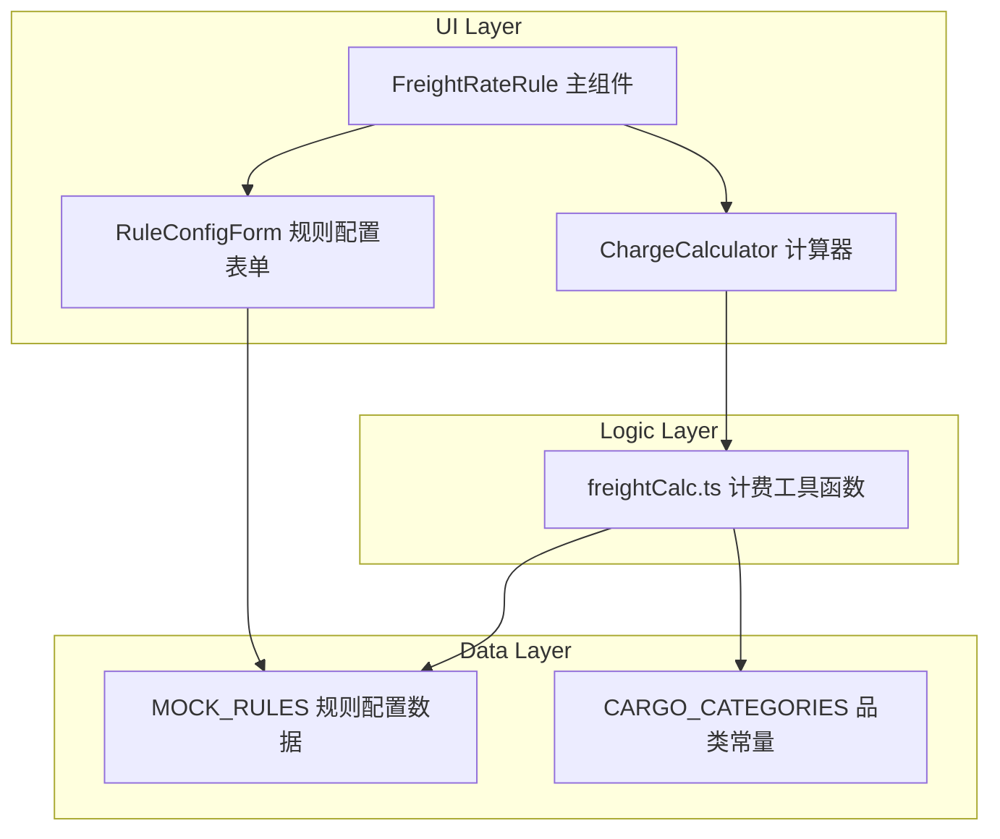
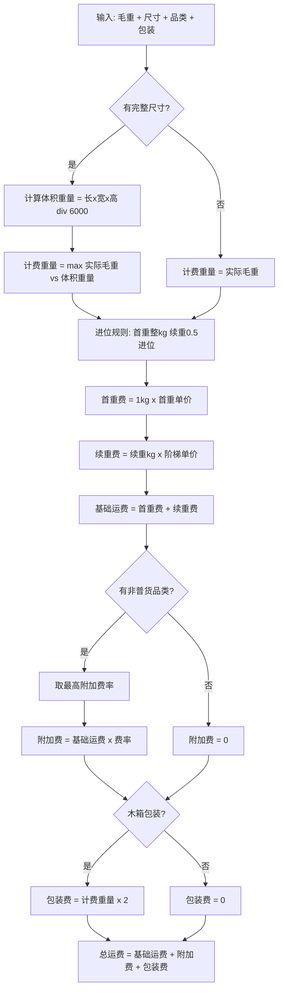
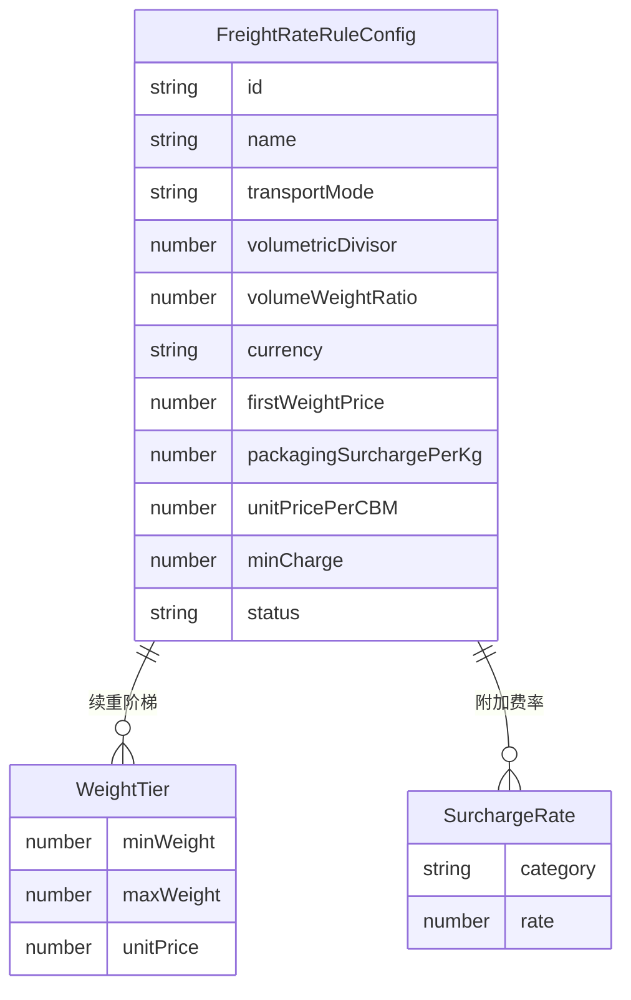

# Design Document: 运费计费规则模块

## Overview

**Purpose**: 本功能为喵喵国际物流管理系统提供空运和海运拼箱的完整运费计算能力，使销售人员能够即时获得准确报价，系统管理员能够灵活配置计费参数。

**Users**: 销售人员使用运费计算器快速报价；系统管理员（ADMIN/FINANCE）通过规则配置界面维护计费参数。

**Impact**: 扩展现有 `FreightRateRule` 模块，增加首重续重阶梯计费、附加费体系、混装规则和运费金额计算功能。新增 `freightCalc.ts` 工具函数提供可复用的计费逻辑。

### Goals
- 实现空运完整计费链路：计费重量判定 → 进位 → 首重续重阶梯 → 附加费 → 混装 → 总运费
- 保留并增强海运拼箱计费体积判定，增加最终运费金额计算
- 提供交互式运费计算器，实时联动显示计费明细
- 支持文件寄送的固定费率计算

### Non-Goals
- 不改动 `PriceCalculator`（多渠道比价工具，定位不同）
- 不对接后端 API（Demo 原型，Mock-first）
- 不实现历史报价存储或报价单导出
- 不处理整柜（FCL）运费计算

## Architecture

### Existing Architecture Analysis

现有 `FreightRateRule.tsx` 包含：
- `FreightRateRule` 接口：运费规则数据结构（transportMode, unitPrice, volumetricDivisor 等）
- `ChargeCalculator` 子组件：空运计费重量和海运拼箱计费体积的交互式计算器
- 规则 CRUD 主组件：规则列表、新建/编辑 Modal、状态切换

**保留的现有模式**：
- 内联样式 + `theme.useToken()`
- `useState` 管理本地状态
- Mock 数据顶部定义
- Ant Design Table + Card + Modal 布局

### Architecture Pattern & Boundary Map



**Architecture Integration**:
- Selected pattern: 混合扩展 — 提取计算逻辑到 utils，增强现有 UI 组件
- Domain boundaries: 计费逻辑（freightCalc.ts）与 UI 展示（ChargeCalculator）分离
- Existing patterns preserved: 内联样式、useState、Mock 数据、Ant Design 组件
- New components rationale: freightCalc.ts 提取纯函数供多场景复用
- Steering compliance: Module-first 组织，PascalCase 组件命名，camelCase 函数命名

### Technology Stack

| Layer | Choice / Version | Role in Feature | Notes |
|-------|------------------|-----------------|-------|
| Frontend | React 19 + TypeScript | UI 交互和状态管理 | 现有技术栈 |
| UI Library | Ant Design v6 | 表单、表格、卡片、标签等组件 | 现有技术栈 |
| 计算逻辑 | TypeScript 纯函数 | freightCalc.ts 计费工具 | 新增文件 |
| 数据 | 内存 Mock 常量 | MOCK_RULES 扩展 | 现有模式 |

## System Flows

### 空运运费计算流程



关键决策：续重阶梯为"区间统一单价"模式（非分段累加），即续重全部重量按落入区间的单价计算。混装取最高附加费率应用于全票。

## Requirements Traceability

| Requirement | Summary | Components | Interfaces | Flows |
|-------------|---------|------------|------------|-------|
| 1.1, 1.2, 1.3 | 空运计费重量判定 | ChargeCalculator, freightCalc | calcChargeableWeight | 空运计算流程 |
| 2.1, 2.2, 2.3 | 重量进位规则 | freightCalc | roundWeight | 空运计算流程 |
| 3.1, 3.2, 3.3, 3.4 | 首重续重阶梯计费 | ChargeCalculator, freightCalc | calcAirFreight | 空运计算流程 |
| 4.1, 4.2, 4.3 | 非普货附加费 | ChargeCalculator, freightCalc | calcSurcharge, CARGO_CATEGORIES | 空运计算流程 |
| 5.1, 5.2, 5.3 | 包装附加费 | ChargeCalculator, freightCalc | calcPackagingSurcharge | 空运计算流程 |
| 6.1, 6.2, 6.3, 6.4 | 混装计费规则 | ChargeCalculator, freightCalc | resolveMixedCargoRate | 空运计算流程 |
| 7.1-7.6 | 海运拼箱计费体积 | ChargeCalculator, freightCalc | calcSeaLCLVolume | 已有（微调） |
| 8.1-8.6 | 计费规则配置管理 | FreightRateRule, RuleConfigForm | FreightRateRuleConfig | — |
| 9.1-9.6 | 运费计算器 | ChargeCalculator | — | 空运/海运计算流程 |
| 10.1, 10.2, 10.3 | 文件寄送费用 | ChargeCalculator, freightCalc | calcDocumentFee | — |

## Components and Interfaces

| Component | Domain/Layer | Intent | Req Coverage | Key Dependencies | Contracts |
|-----------|-------------|--------|--------------|------------------|-----------|
| freightCalc | Logic/Utils | 运费计费纯函数工具库 | 1-7, 10 | 无外部依赖 (P0) | Service |
| ChargeCalculator | UI/System | 交互式运费计算器（扩展） | 1-7, 9, 10 | freightCalc (P0) | State |
| FreightRateRule | UI/System | 规则配置管理主页面（扩展） | 8 | ChargeCalculator (P0) | State |

### Logic Layer

#### freightCalc.ts

| Field | Detail |
|-------|--------|
| Intent | 提供空运和海运拼箱的完整计费计算纯函数 |
| Requirements | 1.1-1.3, 2.1-2.3, 3.1-3.4, 4.1-4.3, 5.1-5.3, 6.1-6.4, 7.1-7.5, 10.1-10.3 |

**Responsibilities & Constraints**
- 所有计算函数为纯函数，无副作用，不依赖外部状态
- 输入为基础数值类型，输出为结构化结果对象
- 金额计算精度保留2位小数

**Dependencies**
- 无外部依赖，仅依赖 TypeScript 标准库

**Contracts**: Service [x]

##### Service Interface

```typescript
/** 货物品类 */
type CargoCategory =
  | 'NORMAL'        // 普货
  | 'ELECTRONIC'    // 带电产品
  | 'MAGNETIC'      // 带磁产品
  | 'FOOD'          // 食品
  | 'COSMETIC'      // 化妆品
  | 'CHEMICAL'      // 化工品
  | 'MEDICINE'      // 药品
  | 'HEALTH'        // 保健品
  | 'MOBILE_PHONE'; // 手机

/** 品类附加费率映射 */
type SurchargeRateMap = Record<Exclude<CargoCategory, 'NORMAL'>, number>;

/** 续重阶梯定义 */
interface WeightTier {
  minWeight: number;    // 区间最小重量 (kg)
  maxWeight: number | null; // 区间最大重量，null 表示无上限
  unitPrice: number;    // 该区间单价 (元/kg)
}

/** 空运计费配置 */
interface AirFreightConfig {
  volumetricDivisor: number;     // 体积重除数，默认 6000
  firstWeightPrice: number;      // 首重单价，默认 63
  continuationTiers: WeightTier[]; // 续重阶梯
  surchargeRates: SurchargeRateMap; // 品类附加费率
  packagingSurchargePerKg: number;  // 木箱包装附加费单价，默认 2
}

/** 海运拼箱计费配置 */
interface SeaLCLConfig {
  volumeWeightRatio: number; // 1m³ = Nkg，默认 700
  unitPricePerCBM: number;   // 每立方米单价
}

/** 文件寄送配置 */
interface DocumentFeeConfig {
  prepaidCNY: number;    // 预付价格（人民币），默认 150
  collectUSD: number;    // 到付价格（美元），默认 21
  maxWeightKg: number;   // 限重（kg），默认 0.5
}

/** 计费重量结果 */
interface ChargeableWeightResult {
  actualWeight: number;
  volumetricWeight: number | null;
  chargeableWeight: number;
  basis: 'ACTUAL' | 'VOLUMETRIC' | 'ACTUAL_ONLY';
}

/** 进位后重量结果 */
interface RoundedWeightResult {
  originalWeight: number;
  roundedWeight: number;
  firstWeight: number;       // 首重 (1kg)
  continuationWeight: number; // 续重
}

/** 空运运费计算明细 */
interface AirFreightBreakdown {
  chargeableWeight: ChargeableWeightResult;
  roundedWeight: RoundedWeightResult;
  firstWeightFee: number;          // 首重费用
  continuationWeightFee: number;   // 续重费用
  continuationUnitPrice: number;   // 续重适用单价
  continuationTierIndex: number;   // 命中的阶梯索引
  baseFreight: number;             // 基础运费 = 首重 + 续重
  surchargeRate: number;           // 附加费率 (0 表示无)
  surchargeCategory: CargoCategory | null; // 适用的品类
  surchargeAmount: number;         // 附加费金额
  isMixedCargo: boolean;           // 是否混装
  packagingSurcharge: number;      // 包装附加费
  totalFreight: number;            // 总运费
}

/** 海运拼箱计费结果 */
interface SeaLCLBreakdown {
  actualVolume: number;
  grossWeight: number;
  density: number;
  cargoType: 'LIGHT' | 'HEAVY';
  convertedVolume: number;
  chargeableVolume: number;
  unitPrice: number;
  totalFreight: number;
}

/** 文件寄送计费结果 */
interface DocumentFeeResult {
  paymentType: 'PREPAID' | 'COLLECT';
  amount: number;
  currency: 'CNY' | 'USD';
  overweight: boolean;
}

/** freightCalc 接口 */
interface FreightCalcService {
  /** 计算空运计费重量（R1） */
  calcChargeableWeight(
    actualWeightKg: number,
    lengthCm: number | null,
    widthCm: number | null,
    heightCm: number | null,
    divisor: number
  ): ChargeableWeightResult;

  /** 重量进位（R2） */
  roundWeight(weightKg: number): RoundedWeightResult;

  /** 解析混装最高附加费率（R6） */
  resolveMixedCargoRate(
    categories: CargoCategory[],
    surchargeRates: SurchargeRateMap
  ): { rate: number; category: CargoCategory | null; isMixed: boolean };

  /** 完整空运运费计算（R1-R6） */
  calcAirFreight(
    actualWeightKg: number,
    lengthCm: number | null,
    widthCm: number | null,
    heightCm: number | null,
    categories: CargoCategory[],
    hasWoodenBox: boolean,
    config: AirFreightConfig
  ): AirFreightBreakdown;

  /** 海运拼箱计费体积和运费（R7） */
  calcSeaLCLFreight(
    actualVolumeCBM: number,
    grossWeightKg: number,
    config: SeaLCLConfig
  ): SeaLCLBreakdown;

  /** 文件寄送费用（R10） */
  calcDocumentFee(
    weightKg: number,
    paymentType: 'PREPAID' | 'COLLECT',
    config: DocumentFeeConfig
  ): DocumentFeeResult;
}
```

- Preconditions: 重量和尺寸参数 ≥ 0
- Postconditions: 返回结构化结果，金额保留2位小数
- Invariants: 总运费 = 基础运费 + 附加费 + 包装费

**Implementation Notes**
- 续重阶梯匹配：按续重总量找到最后一个 `minWeight ≤ 续重` 的区间，整段按该单价计算
- 进位规则：`Math.ceil(weight * 2) / 2` 实现0.5进位，首重单独 `Math.ceil`
- 附加费基于基础运费（首重+续重），不含包装费

### UI Layer

#### ChargeCalculator（扩展）

| Field | Detail |
|-------|--------|
| Intent | 交互式运费计算器，用户输入参数后实时显示计费明细 |
| Requirements | 1.1-1.3, 2.1-2.3, 3.1-3.4, 4.1-4.3, 5.1-5.3, 6.1-6.4, 7.1-7.6, 9.1-9.6, 10.1-10.3 |

**Responsibilities & Constraints**
- 提供空运/海运拼箱/文件寄送三个 Tab 页
- 空运 Tab 增加品类多选标签、木箱包装开关
- 调用 freightCalc 函数获取计算结果
- 实时联动：任一输入变化自动重新计算
- 显示完整费用明细卡片（分项展示）

**Dependencies**
- Inbound: FreightRateRule 主组件 — 嵌入使用 (P0)
- Outbound: freightCalc.ts — 计费计算 (P0)

**Contracts**: State [x]

##### State Management

```typescript
/** 空运计算器状态 */
interface AirCalcState {
  actualWeight: number | null;
  length: number | null;
  width: number | null;
  height: number | null;
  categories: CargoCategory[];
  hasWoodenBox: boolean;
}

/** 海运拼箱计算器状态 */
interface SeaLCLCalcState {
  actualVolume: number | null;
  grossWeight: number | null;
}

/** 文件寄送计算器状态 */
interface DocCalcState {
  weight: number | null;
  paymentType: 'PREPAID' | 'COLLECT';
}
```

- State model: 每个 Tab 独立状态，通过 useState 管理
- Persistence: 无持久化，页面刷新重置
- Concurrency: 单用户操作，无并发问题

**Implementation Notes**
- 空运 Tab：品类使用 `Select mode="multiple"` + Tag 展示，木箱包装使用 `Switch`
- 费用明细使用 `Descriptions` 组件分项展示：计费重量判定 → 进位结果 → 首重/续重分项 → 附加费 → 包装费 → 总计
- 实时计算使用 `useMemo` 依赖输入状态
- 混装标记：当检测到多品类时显示 `Tag color="warning"` 标注"混装计费"

#### FreightRateRule 主组件（扩展）

| Field | Detail |
|-------|--------|
| Intent | 运费规则配置管理，增加阶梯和附加费配置能力 |
| Requirements | 8.1-8.6 |

**Responsibilities & Constraints**
- 扩展规则 CRUD 表单，增加空运阶梯价格配置（动态增减行）和附加费率配置
- 规则列表增加阶梯和附加费摘要展示
- 仅 ADMIN 和 FINANCE 角色可见（已有权限控制）

**Dependencies**
- Inbound: App.tsx ContentRenderer — 页面挂载 (P0)
- Outbound: ChargeCalculator — 计费计算器 (P0)

**Contracts**: State [x]

**Implementation Notes**
- 新建/编辑 Modal 增加阶梯配置区域：动态 `Form.List` 管理阶梯行（minWeight, maxWeight, unitPrice）
- 附加费率配置：品类列表 + 百分比输入，使用 `Table` 内联编辑模式
- 海运拼箱 Tab 增加单价配置字段

## Data Models

### Domain Model



### Logical Data Model

**扩展后的 FreightRateRule 接口**：

```typescript
interface FreightRateRuleConfig {
  id: string;
  name: string;
  transportMode: 'AIR' | 'SEA_LCL';
  // 空运参数
  volumetricDivisor: number;
  firstWeightPrice: number;
  continuationTiers: WeightTier[];
  surchargeRates: SurchargeRateMap;
  packagingSurchargePerKg: number;
  // 海运拼箱参数
  volumeWeightRatio: number;
  unitPricePerCBM: number;
  // 通用
  currency: string;
  minCharge: number;
  remark: string;
  status: 'ACTIVE' | 'INACTIVE';
  createdAt: string;
  updatedAt: string;
}
```

- 与现有 `FreightRateRule` 接口合并，新增字段均为可选（后向兼容）
- Mock 数据 `MOCK_RULES` 中现有4条规则需补充阶梯和附加费字段
- 数据仅存在于内存 Mock，无持久化需求

### Default Configuration Data

```typescript
/** 默认空运配置 */
const DEFAULT_AIR_CONFIG: AirFreightConfig = {
  volumetricDivisor: 6000,
  firstWeightPrice: 63,
  continuationTiers: [
    { minWeight: 1, maxWeight: 5, unitPrice: 60 },
    { minWeight: 5, maxWeight: 20, unitPrice: 57 },
    { minWeight: 20, maxWeight: null, unitPrice: 55 },
  ],
  surchargeRates: {
    ELECTRONIC: 0.10,
    MAGNETIC: 0.10,
    FOOD: 0.10,
    COSMETIC: 0.10,
    CHEMICAL: 0.25,
    MEDICINE: 0.40,
    HEALTH: 0.40,
    MOBILE_PHONE: 0.60,
  },
  packagingSurchargePerKg: 2,
};

/** 默认文件寄送配置 */
const DEFAULT_DOC_CONFIG: DocumentFeeConfig = {
  prepaidCNY: 150,
  collectUSD: 21,
  maxWeightKg: 0.5,
};
```

## Error Handling

### Error Strategy
所有计费函数返回结构化结果对象，不抛出异常。UI 层通过检查结果字段判断状态。

### Error Categories and Responses
**User Errors**:
- 未填必填字段 → Ant Design Form 字段级验证，红色提示
- 输入负数或零重量 → InputNumber min=0 限制 + 结果区域不显示
- 文件寄送超重 → `DocumentFeeResult.overweight = true` → 显示 Alert 警告

**Business Logic Errors**:
- 无匹配阶梯 → 使用最后一个阶梯（最高重量区间无上限）
- 品类选择为空 → 按普货处理，附加费率为0

## Testing Strategy

本项目无测试框架（Demo 原型），测试策略以手动验证为主：

### 手动验证用例
- **空运基础计算**: 输入15kg普货 → 验证首重63 + 续重14×57 = 861元（文档示例）
- **体积重量判定**: 输入尺寸使体积重>实际重 → 验证取体积重
- **进位规则**: 输入13.3kg → 验证续重进位至12.5kg
- **附加费**: 选择"手机" → 验证基础运费×60%
- **混装**: 选择"带电+化工品" → 验证按25%（最高）计费
- **海运拼箱**: 输入2m³/1800kg → 验证重货判定，计费体积2.57m³
- **文件寄送**: 输入0.3kg预付 → 150元；输入0.6kg → 超重警告
