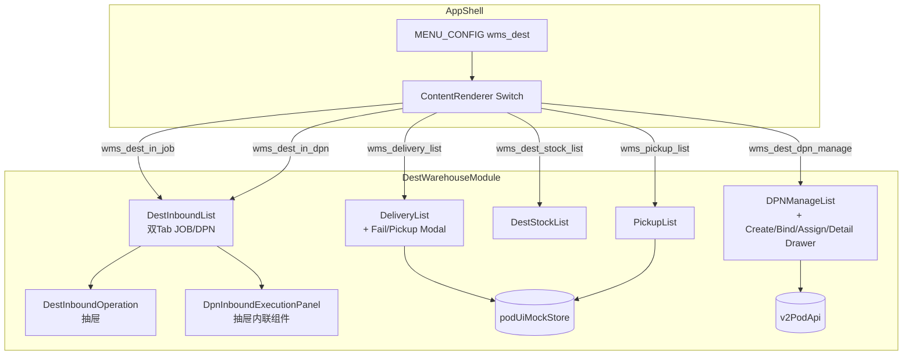
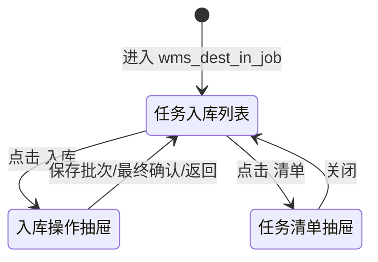
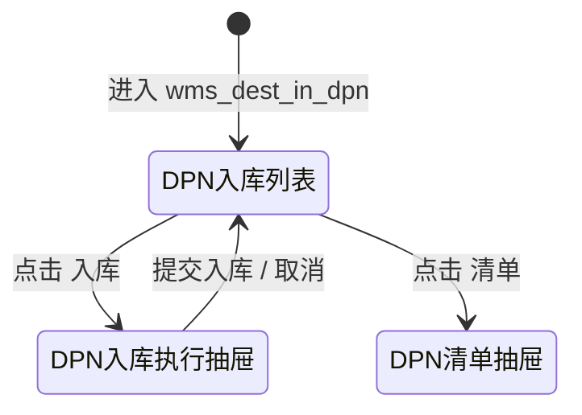
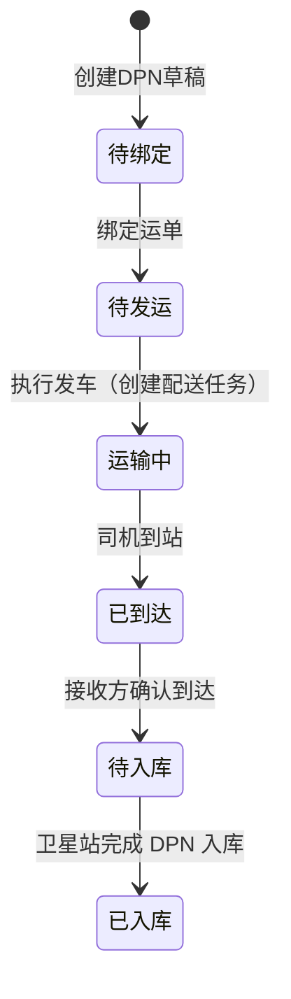
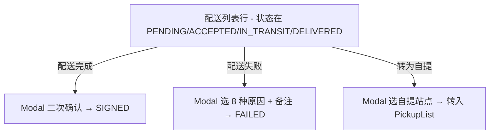
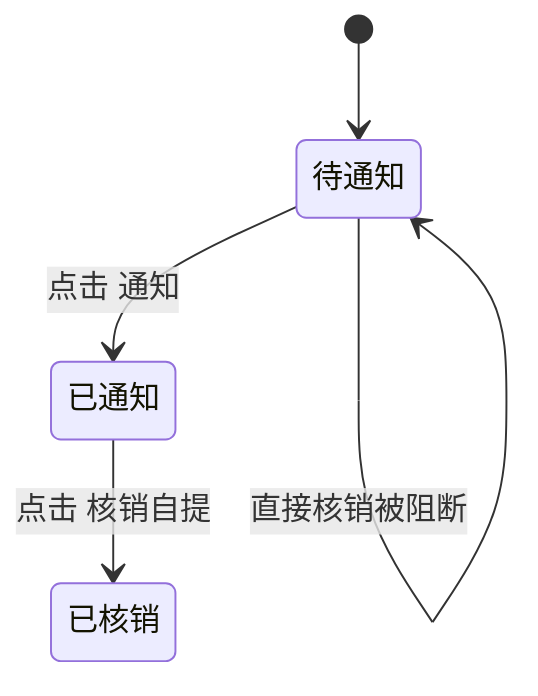
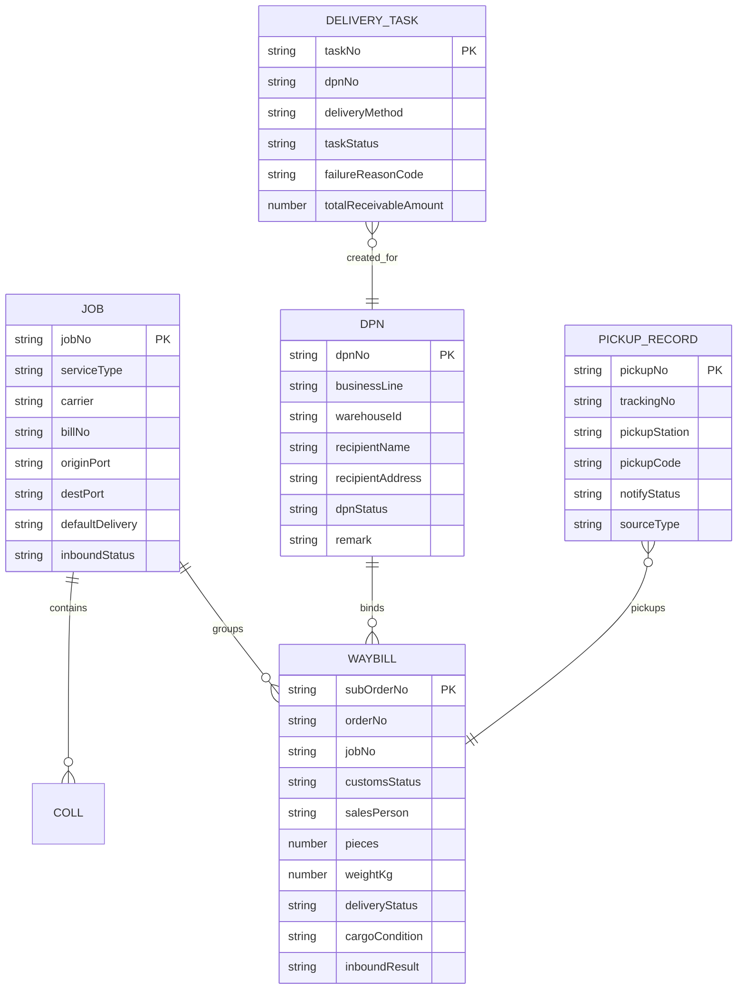

# Design Document — 到达国仓储模块

## Overview

**Purpose**: 本模块为到达国仓库操作员（WAREHOUSE_US）和到达国运营人员（OPS_US）提供完整的"任务入库 / DPN 入库 → 库存查询 → DPN 跨站点调拨 → 配送列表 / 自提列表"业务链路界面。

**Users**: 到达国仓库操作员负责货物入库、库存调度、配送/自提核销；到达国运营人员负责 DPN 跨站点调拨、绑单和发车。

**Impact**: 在 `client/src/pages/wms/destination/` 下维护 6 个核心页面入口组件 + 操作子组件 + 共享 Mock Store；通过 `App.tsx` 的 `MENU_CONFIG.wms_dest` 暴露 6 个 Tab。

### Goals
- 完整覆盖任务入库 / DPN 入库 / 库存查询 / DPN 管理 / 配送列表 / 自提列表 6 个 Tab 的交互流程
- 沿用现有项目的代码模式（内联样式、useState/useMemo、`v2PodApi` / Mock Store、Ant Design v6）
- 支持国家-城市-站点三级级联筛选与站点数据隔离

### Non-Goals
- 真实后端 API 对接（DPN 部分使用 `v2PodApi` 但允许 Mock 数据回填，库存/入库/配送/自提全部 Mock）
- BLE 设备扫码（仅 UI 输入框模拟）
- 打印功能的实际实现（按钮 + message 占位）
- 通知短信的实际发送

## Architecture

### Existing Architecture Analysis

`wms/destination/` 下的关键组件如下，全部已落地：

| 组件 | 角色 | 备注 |
|------|------|------|
| `DestInboundList.tsx` | 任务入库 + DPN 入库列表（双 Tab） | 通过 `initialTab` prop 控制默认进入 JOB / DPN 维度，全部内联 Mock 数据 |
| `DestInboundOperation.tsx` | 货物入库操作子页面 | 由 `DestInboundList` 在抽屉中渲染，支持扫码、集装箱筛选、保存批次、最终确认 |
| `DPNManageList.tsx` | DPN 管理列表 | 调用 `v2PodApi`（创建/绑单/派单/获取详情），同时回填 `MOCK_DPN_ROWS` 保证状态可演示 |
| `DestStockList.tsx` | 库存查询 | 内联 Mock 数据，支持 6 类操作按钮 |
| `DeliveryList.tsx` | 配送列表 | 通过 `podUiMockStore` 提供数据 + 配送完成/失败/转自提 mutator |
| `PickupList.tsx` | 自提列表 | 同样基于 `podUiMockStore`，提供通知 / 核销 mutator |
| `podUiMockStore.ts` | POD（配送/自提）共享 Mock 仓库 | 暴露 `buildDeliveryTaskRows` / `markDeliveryTaskCompleted` / `markDeliveryTaskFailed` / `convertDeliveryTaskToPickup` / `listPickupRecords` / `markPickupNotified` / `markPickupCompleted` |

`DPNDetail.tsx` / `DPNInbound.tsx` / `JobDetail.tsx` 等历史组件存在于目录中但未在菜单中使用（按需引用或废弃保留）。`DestInboundDetail.tsx` 系列文件为遗留备份，目前由 `DestInboundList` 内的抽屉直接渲染清单和操作面板。

### Architecture Pattern & Boundary Map



**Architecture Integration**:
- **Selected pattern**: 单页 + Drawer/Modal 控制操作子视图，与 `DestInboundList`、`DPNManageList` 现有写法一致。
- **Domain boundaries**: 入库（Inbound JOB/DPN）、库存（Stock）、DPN 调拨（DPN）、末端交付（Delivery / Pickup）。
- **Existing patterns preserved**: `theme.useToken()` 内联样式、`ListPageToolbar` 工具栏、`useTableScrollY` 自适应表格高度、`message.useMessage()` 局部提示。

### Technology Stack

| Layer | Choice / Version | Role | Notes |
|-------|------------------|------|-------|
| Frontend | React 19 + TypeScript | 所有页面组件 | strict mode |
| UI Library | Ant Design v6 | Table、Drawer、Modal、Form、Radio、Checkbox、Select、Tag、Popover、Segmented | 主要交互组件 |
| 时间 | dayjs | 日期格式化与筛选 | YYYY-MM-DD HH:mm:ss |
| 状态 | useState + useMemo + useCallback | 组件内状态管理 | 无外部状态库 |
| 数据 | `v2PodApi`（DPN）+ inline mock + `podUiMockStore`（配送/自提） | 数据加载与可变状态 | 全部可在无后端环境运行 |

## System Flows

### 任务入库流程（JOB Tab）



### DPN 入库流程（DPN Tab）



### DPN 跨站点调拨生命周期



### 配送任务流程



### 自提流程



## Requirements Traceability

| Requirement | Summary | Components | Data Source |
|-------------|---------|------------|-------------|
| 1.1-1.8 | 任务入库列表 | DestInboundList (JOB Tab) | inline `buildMockJobs` |
| 2.1-2.10 | 货物入库操作 | DestInboundOperation | `buildInboundItemsByJob` |
| 3.1-3.8 | DPN 入库列表与执行 | DestInboundList (DPN Tab) + DpnInboundExecutionPanel | inline `buildMockDpns` |
| 4.1-4.10 | 库存查询 | DestStockList | inline `buildMockData` |
| 5.1-5.13 | DPN 管理 | DPNManageList | `v2PodApi` + `MOCK_DPN_ROWS` 兜底 |
| 6.1-6.7 | 配送列表 | DeliveryList | `podUiMockStore.buildDeliveryTaskRows` |
| 7.1-7.6 | 自提列表 | PickupList | `podUiMockStore.listPickupRecords` |
| 8.1-8.4 | 三级级联筛选 | 所有列表组件 | `COUNTRY_CITY_STATION` / `LOCATION_DATA` |

## Components and Interfaces

### Inbound Domain

#### DestInboundList

| Field | Detail |
|-------|--------|
| Intent | 任务入库 + DPN 入库双 Tab 列表，通过 Drawer 渲染入库操作 / 清单 |
| Requirements | 1.1-1.8, 3.1-3.8 |
| Props | `warehouseId?: string`, `businessMode?: 'ALL' \| 'SEA' \| 'AIR'`, `initialTab?: 'JOB' \| 'DPN'` |

**Responsibilities**
- 维护 `jobRows` / `dpnRows` 两份 Mock 数据，根据 `initialTab` 默认进入对应 Tab
- 国家→城市→站点三级级联筛选 + 入库状态下拉 + 关键词搜索
- 通过 `DrawerState` 联合类型控制四种抽屉：JOB_OPERATION、JOB_MANIFEST、DPN_OPERATION、DPN_MANIFEST
- DPN 操作使用内联组件 `DpnInboundExecutionPanel` 实现按运单勾选 + 扫码定位 + 提交入库
- 维护 `jobDrafts: Record<jobId, InboundOperationItem[]>`，跨抽屉保留 JOB 入库进度

**关键类型**
```typescript
interface JobInboundRecord {
  id: string;
  businessLine: 'SEA' | 'AIR';
  jobNo: string;
  serviceType: 'EXPRESS' | 'STANDARD';
  inboundStatus: 'PENDING' | 'PARTIAL' | 'COMPLETED';
  defaultDelivery: 'DELIVERY' | 'PICKUP' | 'PENDING' | 'MIXED';
  currentStation: string;
  totalPieces: number;
  totalWeight: number;
  updatedAt: string;
  customsStatus: string;
  releaseTime: string;
  carrier: string;
  billNo: string;
  originPort: string;
  destPort: string;
  collNumbers: string[];
  details: InboundDetailRow[];
}

interface DpnInboundRecord {
  id: string;
  businessLine: 'SEA' | 'AIR';
  dpnNo: string;
  inboundStatus: 'PENDING' | 'PARTIAL' | 'COMPLETED';
  defaultDelivery: 'DELIVERY' | 'PICKUP' | 'PENDING' | 'MIXED';
  currentStation: string;
  totalPieces: number;
  totalWeight: number;
  routeName: string;
  transportMode: string;
  consigneeName: string;
  destinationStation: string;
  executeDate: string;
  consigneePhone: string;
  consigneeAddress: string;
  logisticsCompany: string;
  queryPhone: string;
  driverName: string;
  driverPhone: string;
  plateNo: string;
  remarks: string;
  relatedJobNos: string[];
  arrivalStatus: string;
  arrivalTime: string;
  details: InboundDetailRow[];
}

interface InboundDetailRow {
  id: string;
  relatedJobNo: string;
  collNo?: string;
  orderNo: string;
  subOrderNo: string;
  customsStatus: string;
  salesName: string;
  cargoDesc: string;
  pieces: number;
  weightKg: number;
  inboundResult: 'WAREHOUSE' | 'DAMAGED' | 'PACKING_DAMAGED' | 'LOST';
  handled?: boolean;
}
```

#### DestInboundOperation

| Field | Detail |
|-------|--------|
| Intent | JOB 维度逐运单核收，支持扫码、集装箱筛选、批次保存与最终确认 |
| Requirements | 2.1-2.10 |
| Props | `jobId`, `jobNo`, `initialItems`, `onSaveBatch`, `onFinalConfirm`, `onBack` |

**State**
```typescript
interface InboundOperationItem {
  id: string;
  jobNo: string;
  collNumber: string;
  collPieces: number;
  trackingNo: string;
  clearanceStatus: 'CLEARED' | 'NOT_CLEARED';
  salesPerson: string;
  description: string;
  pieces: number;
  weightKg: number;
  deliveryStatus: 'WAREHOUSE' | 'DIRECT_DELIVERY';
  cargoCondition: 'GOOD' | 'DAMAGED' | 'PACKING_DAMAGED' | 'LOST';
  handled: boolean;
  lastHandledAt?: string;
}
```

**关键交互**
- `selectedColl` 集装箱筛选下拉、`selectedTrackingNo` 单条定位
- 扫描输入 `handleScanInbound`：先匹配集装箱号再匹配运单号，命中后高亮
- `handleSaveBatch(false)` 仅处理可见筛选范围内未处理的运单 → onSaveBatch 回调
- `handleSaveBatch(true)` 校验所有运单已处理 → onFinalConfirm 回调，否则 message.warning
- 表格列：集装箱号（rowSpan 合并）、运单号、清关状态、业务员、说明、件数、重量、去向 Radio、货物状态 Radio、处理状态

#### DpnInboundExecutionPanel（DestInboundList 内联）

| Field | Detail |
|-------|--------|
| Intent | DPN 维度按运单勾选 + 扫码定位 + 选择入库结果 |
| Requirements | 3.3-3.7 |

**列**: 所属任务（rowSpan 合并）、运单号、到站状态 Tag、业务员、说明、件数、重量、入库结果 Radio（到达仓库/货损/包装损/货物遗失）、处理状态 Tag。

### Stock Domain

#### DestStockList

| Field | Detail |
|-------|--------|
| Intent | 库存统一查询，支持安排配送/自提与转换 |
| Requirements | 4.1-4.10 |

**关键类型**
```typescript
interface StockWaybillRecord {
  id: string;
  trackingNo: string;
  orderNo: string;
  country: string;
  city: string;
  salesPerson: string;
  userName: string;
  route: string;
  serviceType: 'EXPRESS' | 'STANDARD';
  description: string;
  weightKg: number;
  pieces: number;
  paymentMethod: 'PREPAID' | 'COD';
  paymentStatus: 'PAID' | 'UNPAID';
  fulfillmentMethod: 'DELIVERY' | 'SELF_PICKUP';
  deliveryStatus: 'IN_STOCK' | 'DPN_BOUND' | 'PICKUP_PENDING';
  logisticsStatus: string;
  logisticsStation: string;
  notified: boolean;
  updatedAt: string;
}
```

**LOCATION_DATA**: 尼日利亚（拉各斯：IKEJ STA / HAIZ STA、卡诺：KANO STA、阿布贾：ABUJ STA、奥尼查：ONIT STA）、加纳（阿克拉：ACCRA STA）、几内亚（科纳克里：CONK STA）、中国（广州：GZ STA、深圳：SZ STA）。

**操作按钮**
- IN_STOCK：安排配送（弹 Modal 录入司机姓名/电话） + 安排自提
- DPN_BOUND：转为自提
- PICKUP_PENDING：转为配送
- 通用：通知（已通知后置灰）+ 打印

### DPN Domain

#### DPNManageList

| Field | Detail |
|-------|--------|
| Intent | DPN 跨站点调拨管理，支持发出/接收双视角协同 |
| Requirements | 5.1-5.13 |

**关键类型**
```typescript
type DpnStatus = 'DRAFT' | 'PENDING_ASSIGN' | 'ASSIGNED' | 'IN_TRANSIT' | 'DELIVERED' | 'SIGNED' | 'CANCELLED';
type DpnRoleType = 'ALL' | 'SENDER' | 'RECEIVER';

interface DpnListRow {
  id: string;
  dpnNo: string;
  businessLine: 'SEA' | 'AIR';
  warehouseId: string;
  warehouseName: string;
  recipientName: string;
  recipientPhone: string;
  recipientAddress: string;
  totalPieces: number;
  totalWeightKg: number;
  itemCount: number;
  subOrderCount: number;
  dpnStatus: DpnStatus;
  latestTaskNo: string;
  latestTaskStatus: string;
  updatedAt: string;
  createdAt: string;
  jobNos: string[];
  orderNos: string[];
  routeNames: string[];
  remark: string;
}

interface DpnViewRow extends DpnListRow {
  viewId: string;
  roleType: 'SENDER' | 'RECEIVER';
  senderStation: string;
  receiverStation: string;
  currentStatusText: string;
  currentStationRoleText: string;
}
```

**统一状态文案**: `buildUnifiedStatusText` 将 DpnStatus 映射为「待绑定/待发运/运输中/已到达/已入库/已取消」。

**Remark 元数据**: `parseRemarkMeta(remark)` 解析竖线分隔的 `key:value` 字符串，提取 `routeName / toStation / executeDate / logisticsCompany / queryPhone / driverName / driverPhone / plateNo / note`，用于表格展示和详情回填。

**API 调用**
| 操作 | API | 说明 |
|------|-----|------|
| 拉取列表 | `v2PodApi.listDpns(params)` | 接口失败时使用 `MOCK_DPN_ROWS` 兜底 |
| 创建草稿 | `v2PodApi.createDpnDraft(payload)` | 创建后立即打开绑定抽屉 |
| 拉取候选运单 | `v2PodApi.listDpnCandidates(params)` | 绑定抽屉用 |
| 绑定运单 | `v2PodApi.bindSubOrders(dpnId, { subOrderIds })` | |
| 派单（执行发车） | `v2PodApi.createDeliveryTask(payload)` | 司机姓名/电话/driverUserId |
| 详情 | `v2PodApi.getDpnDetail(dpnId)` | 失败时使用 `MOCK_DPN_DETAIL_MAP` 兜底 |

**Popover 悬停明细**: 「运单数 / 件数 / 重量Kg」列鼠标悬浮调用 `ensureHoverDetail` 异步加载并缓存到 `hoverDetails` map。

### Delivery Domain

#### DeliveryList

| Field | Detail |
|-------|--------|
| Intent | 配送任务列表 + 完成 / 失败 / 转自提 |
| Requirements | 6.1-6.7 |
| Data Source | `podUiMockStore.buildDeliveryTaskRows` |

**关键类型**（来自 `podUiMockStore.ts`）: `DeliveryTaskRow` / `DeliveryTaskStatus` / `DeliveryMethod` / `PaymentStatus` / `DpnStatus`。

**配送失败原因（8 种）**: PHONE_UNREACHABLE、ADDRESS_NOT_FOUND、CUSTOMER_NOT_HOME、CUSTOMER_RESCHEDULE、REFUSED_BY_CUSTOMER、PAYMENT_NOT_READY、SECURITY_RESTRICTION、PACKAGE_DAMAGED。常量 `DELIVERY_FAILURE_REASONS` 暴露 `value/label`。

**自提站点（PICKUP_STATION_OPTIONS）**: IKEJ / ABUJ / LEKKI / YABA STA。

**操作按钮显隐**: 仅当 `taskStatus ∈ {PENDING, ACCEPTED, IN_TRANSIT, DELIVERED}` 且 `dpnStatus ≠ SIGNED/CANCELLED` 且 `deliveryMethod === DELIVERY` 时显示三个按钮。

#### PickupList

| Field | Detail |
|-------|--------|
| Intent | 自提列表 + 通知 / 核销 |
| Requirements | 7.1-7.6 |
| Data Source | `podUiMockStore.listPickupRecords` |

**操作约束**: `markPickupCompleted` 之前必须先 `markPickupNotified`；状态从 PENDING → NOTIFIED → PICKED_UP，前端校验 PENDING 时禁止核销并 message.warning。

## Data Models

### Domain Model



**Business Rules**
- 任务入库使用 JOB 维度，DPN 入库使用 DPN 维度，二者共享 InboundDetailRow 类型
- DPN 跨站点调拨：`SENDER` 角色完成 待绑定→待发运→运输中→已到达；`RECEIVER` 角色完成 待入库→已入库
- 配送失败可转自提，转自提后在 PickupList 出现并标记 `sourceType=CONVERTED`
- 自提核销前必须先发送通知

## Error Handling

### Error Strategy
- API 调用统一 `try/catch`，异常时 `messageApi.error` 提示
- 表单提交使用 Ant Design Form 的 `validateFields`
- 前置条件不满足使用 `Modal.confirm` / `message.warning` 阻断（如自提核销前未通知）

### Error Categories and Responses
- **User Errors**: 表单校验 / 操作前置条件 → 字段红色提示 + Modal/Message
- **System Errors**: API 失败 → message.error，仍保留兜底 mock 数据展示
- **Business Logic Errors**: 自提未通知不能核销 / 已签收 DPN 不能再操作配送 / 已核销自提单不能再次操作

## Testing Strategy

本项目无测试框架，验证方式：
- **手动验证**: 每个 Tab 的筛选、操作按钮、Drawer/Modal 联动是否正确
- **E2E 路径**: 任务入库 → 入库操作 → 保存批次 / 最终确认 → 库存查询可见 → DPN 创建 → 绑定运单 → 执行发车 → DPN 入库 → 配送列表完成签收 / 失败转自提 → 自提列表通知 / 核销
- **边界检查**: 空数据、长地址换行、集装箱号 monospace 渲染、Popover 悬停异步加载、Mock 兜底
