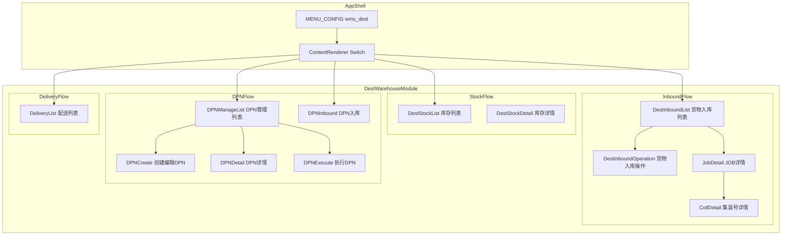
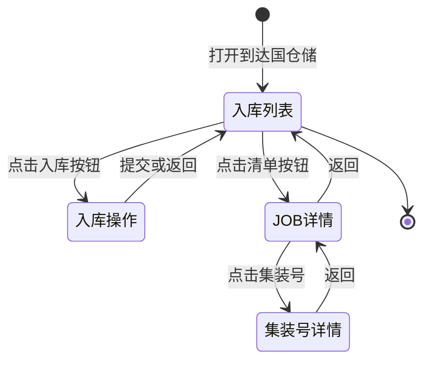
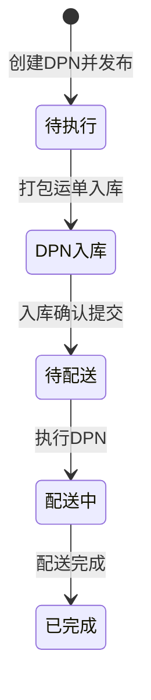
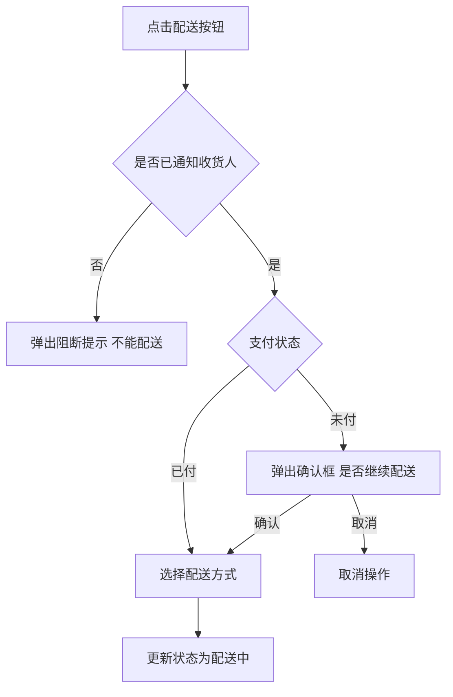
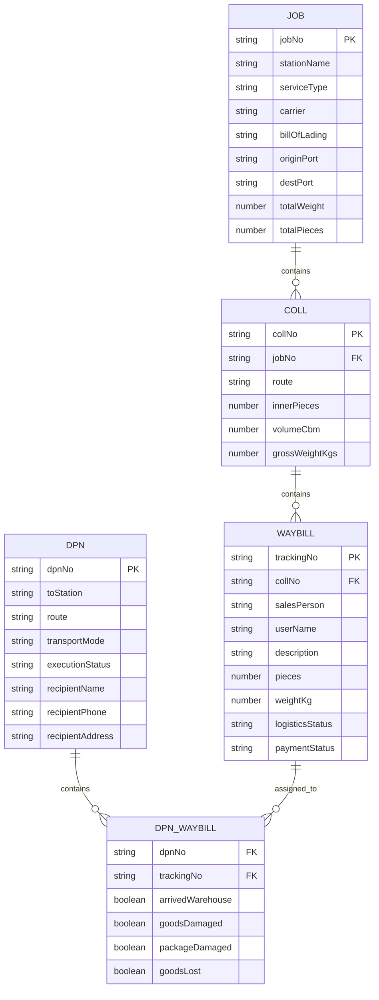

# Design Document — 到达国仓管理模块

## Overview

**Purpose**: 本模块为到达国仓库操作员和运营人员提供完整的货物入库→库存管理→DPN配送组包→配送执行业务链路界面。

**Users**: 到达国仓库操作员（WAREHOUSE_US）执行入库和库存操作；到达国运营人员（OPS_US）管理DPN调度和配送。

**Impact**: 重构现有 `wms/destination/` 下的 6 个核心组件，新增 6 个组件，对齐 Excel 原型中的完整业务流程。

### Goals
- 完整覆盖「货物入库2022」「库存列表2022」「执行DPN任务」「DPN货物入库」「配送列表2022」五份 Excel 原型的交互流程
- 保持与现有项目的代码模式一致（内联样式、useState、warehouseApi/deliveryApi）
- 支持站点数据隔离的三级级联筛选

### Non-Goals
- 真实后端 API 对接（使用 Mock 数据）
- 通知模板内容编辑和 SMS 发送功能（暂不处理）
- 打印功能的实际实现（仅按钮占位 + message 提示）
- 扫码入库的实际扫码功能（仅 UI 切换模式）

## Architecture

### Existing Architecture Analysis

当前 `wms/destination/` 下已有组件遵循以下模式：
- 列表组件（如 `DestInboundList`）通过 `warehouseApi` 加载数据，内部维护筛选/分页 state
- 详情/创建组件作为子组件被列表组件 import，通过 state 控制显示/隐藏
- 类型定义在组件文件顶部（局部类型），共享类型在 `types/delivery.ts` 和 `types/warehouse.ts`
- 所有样式使用内联 + `theme.useToken()`

需保持的模式：API 调用结构、组件文件组织、内联样式、state-driven 视图切换。

### Architecture Pattern & Boundary Map



**Architecture Integration**:
- **Selected pattern**: 页面内 state-driven 视图切换（与现有 DeliveryList 模式一致）
- **Domain boundaries**: 入库流程（Inbound）、库存（Stock）、DPN管理（DPN）、配送（Delivery）四个子域
- **Existing patterns preserved**: warehouseApi/deliveryApi 调用、组件内局部类型、内联样式
- **New components rationale**: DPNManageList/DPNCreate/DPNDetail/DPNExecute 是 Excel 原型中全新的功能，现有代码无对应实现

### Technology Stack

| Layer | Choice / Version | Role in Feature | Notes |
|-------|------------------|-----------------|-------|
| Frontend | React 19 + TypeScript | 所有页面组件 | strict mode |
| UI Library | Ant Design v6 | Table, Card, Form, Checkbox, Select, Tag, Modal | 主要交互组件 |
| Date | dayjs | 日期筛选和格式化 | YYYY-MM-DD HH:mm |
| State | useState + useMemo | 组件内状态管理 | 无外部状态库 |
| API | axios via warehouseApi/deliveryApi | Mock 数据加载 | 保持现有 API 层 |

## System Flows

### 货物入库流程



### DPN 生命周期



### 配送校验流程



## Requirements Traceability

| Requirement | Summary | Components | Interfaces | Flows |
|-------------|---------|------------|------------|-------|
| 1.1-1.8 | 货物入库列表 | DestInboundList | DestInboundJobRecord, FilterState | 入库流程 |
| 2.1-2.9 | 货物入库操作 | DestInboundOperation | InboundOperationItem, AbnormalFlags | 入库流程 |
| 3.1-3.6 | JOB详情与集装号详情 | JobDetail, CollDetail | JobCollRecord, CollWaybillRecord | 入库流程 |
| 4.1-4.7 | 库存列表 | DestStockList | StockRecord, StockFilterState | - |
| 5.1-5.10 | DPN管理列表 | DPNManageList | DPNManageRecord, DPNFilterState | DPN生命周期 |
| 6.1-6.6 | 创建与编辑DPN | DPNCreate | DPNFormData | DPN生命周期 |
| 7.1-7.5 | DPN详情 | DPNDetail | DPNWaybillRecord | DPN生命周期 |
| 8.1-8.8 | 执行DPN任务 | DPNExecute | DPNExecWaybill | DPN生命周期 |
| 9.1-9.10 | 配送列表 | DeliveryList | DeliveryWaybillRecord | 配送校验流程 |
| 10.1-10.7 | DPN入库确认 | DPNInbound | DPNInboundItem, AbnormalFlags | DPN生命周期 |

## Components and Interfaces

| Component | Domain | Intent | Req Coverage | Key Dependencies | Contracts |
|-----------|--------|--------|--------------|------------------|-----------|
| DestInboundList | Inbound | JOB维度入库列表，父子行展示 | 1.1-1.8 | warehouseApi (P0) | State |
| DestInboundOperation | Inbound | 逐件入库确认+异常标记 | 2.1-2.9 | DestInboundList (P0) | State |
| JobDetail | Inbound | JOB下集装号汇总 | 3.1-3.2, 3.6 | DestInboundList (P0) | State |
| CollDetail | Inbound | 集装号运单明细 | 3.3-3.5 | JobDetail (P0) | State |
| DestStockList | Stock | 库存列表查询 | 4.1-4.7 | warehouseApi (P0) | State |
| DPNManageList | DPN | DPN任务管理列表 | 5.1-5.10 | deliveryApi (P0) | State |
| DPNCreate | DPN | 创建/编辑DPN表单 | 6.1-6.6 | DPNManageList (P0) | State |
| DPNDetail | DPN | DPN运单明细 | 7.1-7.5 | DPNManageList (P0) | State |
| DPNExecute | DPN | 执行DPN开始配送 | 8.1-8.8 | DPNManageList (P0) | State |
| DPNInbound | DPN | DPN打包入库确认 | 10.1-10.7 | deliveryApi (P0) | State |
| DeliveryList | Delivery | 配送列表+批量通知+配送校验 | 9.1-9.10 | deliveryApi (P0) | State |

### Inbound Domain

#### DestInboundList（重构）

| Field | Detail |
|-------|--------|
| Intent | JOB维度的货物入库列表，支持父子行展示和多维筛选 |
| Requirements | 1.1, 1.2, 1.3, 1.4, 1.5, 1.6, 1.7, 1.8 |

**Responsibilities & Constraints**
- 以表格展示 JOB 列表，支持父子行合并（一个 JOB 可包含多个子 JOB）
- 集装号列展示 Tag 列表，超出折叠显示"......More"
- 通过 state 控制切换到 DestInboundOperation / JobDetail 子视图

**Dependencies**
- Outbound: DestInboundOperation — 入库操作子视图 (P0)
- Outbound: JobDetail — JOB详情子视图 (P0)
- External: warehouseApi — 数据加载 (P0)

**Contracts**: State [x]

##### State Management

```typescript
interface DestInboundListState {
  // 视图控制
  currentView: 'list' | 'inbound-operation' | 'job-detail';
  selectedJobId: string | null;

  // 筛选
  filters: {
    country: string;
    city: string;
    station: string;
    year: string;
    month: string;
    day: string;
    executionStatus: string;
    keyword: string;
  };

  // 数据
  jobRecords: DestInboundJobRecord[];
  loading: boolean;
}

interface DestInboundJobRecord {
  id: string;
  stationName: string;
  jobNo: string;
  serviceType: 'EXPRESS' | 'STANDARD';
  carrier: string;
  billOfLading: string;
  originPort: string;
  destPort: string;
  collNumbers: string[];
  totalWeight: number;
  totalPieces: number;
  logisticsStatus: string;
  logisticsStatusTime: string;
  logisticsStation: string;
  operatorAccount: string;
  operatorTime: string;
  updatedAt: string;
  // 子 JOB
  children?: DestInboundJobRecord[];
}
```

**Implementation Notes**
- 使用 Ant Design Table 的 `expandable` 属性实现父子行展示（Req 1.5）
- 集装号使用 `Tag` 组件渲染，超过 8 个时截断并显示 Tooltip（Req 1.6）
- 三级级联筛选使用三个联动 `Select` 组件（Req 1.2）

#### DestInboundOperation（新建）

| Field | Detail |
|-------|--------|
| Intent | 逐件货物入库确认，支持异常标记（货物损坏/包装损坏/货物丢失） |
| Requirements | 2.1, 2.2, 2.3, 2.4, 2.5, 2.6, 2.7, 2.8, 2.9 |

**Responsibilities & Constraints**
- 按 JOB/站点 + 集装号分组展示待入库运单
- 每行提供 4 个 Checkbox：到达仓库、货物损坏、包装损坏、货物丢失
- 底部汇总行统计总件数和总重量

**Dependencies**
- Inbound: DestInboundList — 父组件提供 jobId (P0)
- External: warehouseApi — 数据加载 (P0)

**Contracts**: State [x]

##### State Management

```typescript
interface InboundOperationState {
  inboundDate: string;
  scanMode: boolean;
  operatorAccount: string;
  items: InboundOperationItem[];
  loading: boolean;
}

interface InboundOperationItem {
  id: string;
  jobStation: string;
  jobNo: string;
  collNumber: string;
  collPieces: number;
  trackingNo: string;
  clearanceStatus: 'CLEARED' | 'NOT_CLEARED';
  salesPerson: string;
  description: string;
  pieces: number;
  weightKg: number;
  // Checkbox 状态
  arrivedWarehouse: boolean;
  goodsDamaged: boolean;
  packageDamaged: boolean;
  goodsLost: boolean;
}

// 汇总信息
interface InboundSummary {
  totalPieces: number;
  totalWeight: number;
}
```

**Implementation Notes**
- Checkbox 列使用 `Checkbox` 组件，onChange 更新 items 数组中对应项的状态
- 分组显示通过 Table `onCell` rowSpan 合并实现（按 jobStation + collNumber 分组）
- 集装号旁件数（如"AK1 5PCS"）通过 collNumber + collPieces 拼接显示

#### JobDetail（新建）

| Field | Detail |
|-------|--------|
| Intent | 展示 JOB 下所有集装号汇总信息 |
| Requirements | 3.1, 3.2, 3.6 |

**Contracts**: State [x]

##### State Management

```typescript
interface JobDetailState {
  currentView: 'job' | 'coll-detail';
  selectedCollNo: string | null;
  jobNo: string;
  collRecords: JobCollRecord[];
}

interface JobCollRecord {
  id: string;
  collNo: string;
  route: string;
  serviceType: string;
  description: string;
  innerPieces: number;
  sizeCm: string;
  volumeCbm: number;
  volumeWeightKgs: number;
  grossWeightKgs: number;
}
```

#### CollDetail（新建）

| Field | Detail |
|-------|--------|
| Intent | 展示集装号内运单明细，含第三方快递信息 |
| Requirements | 3.3, 3.4, 3.5, 3.6 |

**Contracts**: State [x]

##### State Management

```typescript
interface CollWaybillRecord {
  id: string;
  trackingNo: string;
  thirdPartyCarrier: string;
  thirdPartyTrackingNo: string;
  city: string;
  salesPerson: string;
  userName: string;
  productName: string;
  description: string;
  pieces: number;
  volumeCbm: number;
  volumeWeightKgs: number;
  grossWeightKgs: number;
}
```

### Stock Domain

#### DestStockList（重构）

| Field | Detail |
|-------|--------|
| Intent | 已入库运单库存列表，多维筛选和批量通知操作 |
| Requirements | 4.1, 4.2, 4.3, 4.4, 4.5, 4.6, 4.7 |

**Contracts**: State [x]

##### State Management

```typescript
interface StockListState {
  filters: {
    country: string;
    city: string;
    station: string;
    dateRange: [string, string] | null;
    logisticsStatus: string;
    paymentMethod: string;
    paymentStatus: string;
    salesPerson: string;
    keyword: string;
  };
  records: StockWaybillRecord[];
  selectedRowKeys: string[];
  loading: boolean;
}

interface StockWaybillRecord {
  id: string;
  trackingNo: string;
  salesPerson: string;
  userName: string;
  route: string;
  serviceType: 'EXPRESS' | 'STANDARD';
  description: string;
  weightKg: number;
  pieces: number;
  paymentMethod: 'PREPAID' | 'COD';
  paymentStatus: 'PAID' | 'UNPAID';
  logisticsStatus: string;
  logisticsStation: string;
  updatedAt: string;
}
```

**Implementation Notes**
- 批量通知使用 Table `rowSelection` + 顶部"批量完成通知"按钮（Req 4.6）
- 打印按钮触发 `message.success('打印任务已发送')` 占位（Req 4.7）

### DPN Domain

#### DPNManageList（新建）

| Field | Detail |
|-------|--------|
| Intent | DPN配送调度任务管理列表，父子行展示多JOB |
| Requirements | 5.1, 5.2, 5.3, 5.4, 5.5, 5.6, 5.7, 5.8, 5.9, 5.10 |

**Responsibilities & Constraints**
- DPN 父行展示汇总信息，子行按 JOB 展开显示
- 操作列按执行状态动态显示按钮
- 通过 state 控制切换到 DPNCreate / DPNDetail / DPNExecute 子视图

**Dependencies**
- Outbound: DPNCreate — 创建/编辑 (P0)
- Outbound: DPNDetail — 详情 (P0)
- Outbound: DPNExecute — 执行 (P0)
- External: deliveryApi — 数据加载 (P0)

**Contracts**: State [x]

##### State Management

```typescript
interface DPNManageListState {
  currentView: 'list' | 'create' | 'edit' | 'detail' | 'execute';
  selectedDpnId: string | null;
  filters: {
    country: string;
    city: string;
    year: string;
    month: string;
    route: string;
    logisticsStatus: string;
    executionStatus: string;
    keyword: string;
  };
  records: DPNManageRecord[];
  loading: boolean;
}

interface DPNManageRecord {
  id: string;
  dpnNo: string;
  dpnCreatedAt: string;
  route: string;
  totalWeight: number;
  totalPieces: number;
  logisticsStatus: string;
  logisticsStatusTime: string;
  logisticsStation: string;
  executionStatus: 'PENDING' | 'EXECUTED';
  executionStatusTime: string;
  executionStation: string;
  updatedAt: string;
  // 子行：JOB 列表
  jobs: DPNJobSubRow[];
}

interface DPNJobSubRow {
  jobNo: string;
  station: string;
  orderNos: string[];
  weight: number;
  pieces: number;
}
```

**Implementation Notes**
- 使用 Table `expandable` 实现 DPN→JOB 父子行展示
- 操作列按 executionStatus 条件渲染按钮（Req 5.8, 5.9）
- 订单号超出显示"......更多"使用 Tooltip（Req 5.2）

#### DPNCreate（新建）

| Field | Detail |
|-------|--------|
| Intent | 创建/编辑DPN配送任务表单 |
| Requirements | 6.1, 6.2, 6.3, 6.4, 6.5, 6.6 |

**Contracts**: State [x]

##### State Management

```typescript
interface DPNFormData {
  dpnNo: string;
  createdAt: string;
  creatorAccount: string;
  toStation: string;
  totalWeight: number;
  totalPieces: number;
  executionDate: string | null;
  transportMode: 'AIR' | 'LAND';
  remark: string;
  // 收件人
  recipientName: string;
  recipientPhone: string;
  recipientAddress: string;
  // 物流信息
  logisticsCompany: string;
  logisticsTrackingNo: string;
  queryPhone: string;
  driverName: string;
  driverPhone: string;
  vehiclePlate: string;
}
```

**Implementation Notes**
- 使用 Ant Design `Form` + `Descriptions` 布局，左右两栏（DPN信息 | 收件人+物流信息）
- 编辑模式通过 `isEdit` prop 控制，预填充已有数据（Req 6.5）
- "发布"和"保存"两个按钮通过不同 handler 区分（Req 6.4, 6.6）

#### DPNDetail（新建）

| Field | Detail |
|-------|--------|
| Intent | DPN运单明细展示，支持提交确认入库 |
| Requirements | 7.1, 7.2, 7.3, 7.4, 7.5 |

**Contracts**: State [x]

##### State Management

```typescript
interface DPNDetailState {
  dpnInfo: DPNManageRecord;
  waybills: DPNWaybillRecord[];
}

interface DPNWaybillRecord {
  id: string;
  dpnNo: string;
  dpnRoute: string;
  dpnCreatedAt: string;
  jobStation: string;
  jobNo: string;
  trackingNo: string;
  salesPerson: string;
  userName: string;
  route: string;
  pieces: number;
  sizeCm: string;
  volumeCbm: number;
  volumeWeightKgs: number;
  weightKgs: number;
}
```

#### DPNExecute（新建）

| Field | Detail |
|-------|--------|
| Intent | 执行DPN任务，手动/扫描添加运单开始配送 |
| Requirements | 8.1, 8.2, 8.3, 8.4, 8.5, 8.6, 8.7, 8.8 |

**Contracts**: State [x]

##### State Management

```typescript
interface DPNExecuteState {
  addMode: 'manual' | 'scan';
  departureDate: string | null;
  selectedWaybills: DPNExecWaybill[];
  availableWaybills: DPNExecWaybill[];
  manualSelectedKeys: string[];
}

interface DPNExecWaybill {
  id: string;
  dpnNo: string;
  dpnRoute: string;
  dpnCreatedAt: string;
  jobStation: string;
  jobNo: string;
  orderNo: string;
  salesPerson: string;
  recipientName: string;
  route: string;
  pieces: number;
  sizeCm: string;
  volumeCbm: number;
  volumeWeightKg: number;
  weightKg: number;
}
```

**Implementation Notes**
- 手动添加面板使用 Table `rowSelection`，确认后将选中项从 availableWaybills 移至 selectedWaybills
- "X"移除按钮反向操作，将项移回 availableWaybills（Req 8.6）
- 执行按钮触发状态更新为"配送中"并记录 departureDate（Req 8.7）

#### DPNInbound（重构）

| Field | Detail |
|-------|--------|
| Intent | DPN打包完成后入库确认，逐件checkbox标记 |
| Requirements | 10.1, 10.2, 10.3, 10.4, 10.5, 10.6, 10.7 |

**Contracts**: State [x]

##### State Management

```typescript
interface DPNInboundState {
  inboundMode: 'manual' | 'scan';
  items: DPNInboundItem[];
  loading: boolean;
}

interface DPNInboundItem {
  id: string;
  dpnNo: string;
  dpnRoute: string;
  dpnCreatedAt: string;
  jobStation: string;
  jobNo: string;
  trackingNo: string;
  salesPerson: string;
  userName: string;
  route: string;
  pieces: number;
  weightKg: number;
  arrivedWarehouse: boolean;
  goodsDamaged: boolean;
  packageDamaged: boolean;
  goodsLost: boolean;
}
```

### Delivery Domain

#### DeliveryList（重构）

| Field | Detail |
|-------|--------|
| Intent | 配送运单列表，支持批量通知和配送校验 |
| Requirements | 9.1, 9.2, 9.3, 9.4, 9.5, 9.6, 9.7, 9.8, 9.9, 9.10 |

**Responsibilities & Constraints**
- 批量勾选 + 批量通知功能
- 配送前校验：未通知阻断、未支付提示确认
- 配送方式选择弹窗（自提/配送）

**Contracts**: State [x]

##### State Management

```typescript
interface DeliveryListState {
  filters: {
    country: string;
    city: string;
    station: string;
    serviceType: string;
    paymentMethod: string;
    paymentStatus: string;
    keyword: string;
  };
  records: DeliveryWaybillRecord[];
  selectedRowKeys: string[];
  loading: boolean;
}

interface DeliveryWaybillRecord {
  id: string;
  trackingNo: string;
  serviceType: 'EXPRESS' | 'STANDARD';
  senderName: string;
  recipientName: string;
  recipientPhone: string;
  recipientAddress: string;
  district: string;
  city: string;
  weightKg: number;
  pieces: number;
  paymentMethod: 'PREPAID' | 'COD';
  paymentStatus: 'PAID' | 'UNPAID';
  paymentAmount: number;
  currency: string;
  logisticsStatus: string;
  logisticsStation: string;
  logisticsStatusTime: string;
  notified: boolean;
  notifiedTime: string | null;
  updatedAt: string;
}
```

**Implementation Notes**
- 配送校验逻辑（Req 9.8, 9.9）使用 `Modal.confirm` 和 `Modal.warning`
- 配送方式选择使用 `Modal` + `Radio.Group`（自提/配送）（Req 9.10）
- 批量通知使用 Table `rowSelection` + 操作栏按钮（Req 9.5）

## Data Models

### Domain Model



**Business Rules**:
- 一个 JOB 包含多个集装号（COLL），一个 COLL 包含多个运单（WAYBILL）
- 一个 DPN 可以包含来自不同 JOB 的运单（按目的地重新组包）
- 运单状态流转：已入库 → 待配送 → 配送中 → 已完成
- 入库时可标记异常（货物损坏/包装损坏/货物丢失），异常标记不阻断入库

### Shared Types

```typescript
// 三级级联筛选数据
interface CascadeFilterOption {
  label: string;
  value: string;
  children?: CascadeFilterOption[];
}

// 异常标记（入库操作和DPN入库共用）
interface AbnormalFlags {
  arrivedWarehouse: boolean;
  goodsDamaged: boolean;
  packageDamaged: boolean;
  goodsLost: boolean;
}

// 汇总行数据
interface SummaryRow {
  totalPieces: number;
  totalWeight: number;
  totalVolume?: number;
  totalVolumeWeight?: number;
}
```

## Error Handling

### Error Strategy
- 所有 API 调用使用 try/catch，失败时 `message.error('操作失败，请重试')`
- 表单提交前使用 Ant Design Form 内置校验
- 配送校验使用 Modal.confirm / Modal.warning 阻断用户操作

### Error Categories and Responses
- **User Errors**: 表单校验失败 → 字段级红色提示；配送前置条件不满足 → Modal 弹窗阻断
- **System Errors**: API 请求失败 → message.error + 允许重试
- **Business Logic Errors**: 未通知不能配送 → Modal.warning 阻断；未支付 → Modal.confirm 二次确认

## Testing Strategy

本项目为 Demo 原型，无测试框架。验证方式：
- **手动验证**: 每个页面的筛选、操作、视图切换是否正常工作
- **E2E 路径**: 入库列表→入库操作→提交→库存列表可查 → DPN创建→DPN入库→执行DPN→配送列表
- **边界检查**: 空数据展示、大量集装号折叠、长地址文本截断
