# 喵喵国际物流管理系统 — 系统总体需求规格说明书

> 文档编号: SRS-TOTAL-20260408
> 版本: v2.0
> 生成日期: 2026-04-08
> 数据来源: Web端实际界面MCP截图 + 源码逐文件分析

---

## 目录

1. [系统定位](#1-系统定位)
2. [整体系统架构图](#2-整体系统架构图)
3. [业务域与模块架构](#3-业务域与模块架构)
4. [角色权限体系](#4-角色权限体系)
5. [核心业务实体关系图](#5-核心业务实体关系图)
6. [端到端业务主流程图](#6-端到端业务主流程图)
7. [各模块业务流程图](#7-各模块业务流程图)
8. [状态机流转图（全部实体）](#8-状态机流转图)
9. [数据流转逻辑图](#9-数据流转逻辑图)
10. [多币种与费用体系](#10-多币种与费用体系)
11. [编号规则汇总](#11-编号规则汇总)
12. [全局交互规范](#12-全局交互规范)
13. [需求文档索引](#13-需求文档索引)

---

## 1. 系统定位

跨境物流全链路管理平台（TMS/ERP），面向 **中国 → 非洲（尼日利亚/加纳）** 方向的海运/空运货代公司内部运营团队。

**当前定位**: 产品经理需求 Demo 原型，后端 Express + SQLite 已连通，前端通过 axios 调用 REST API。

---

## 2. 整体系统架构图

### 2.1 技术分层架构

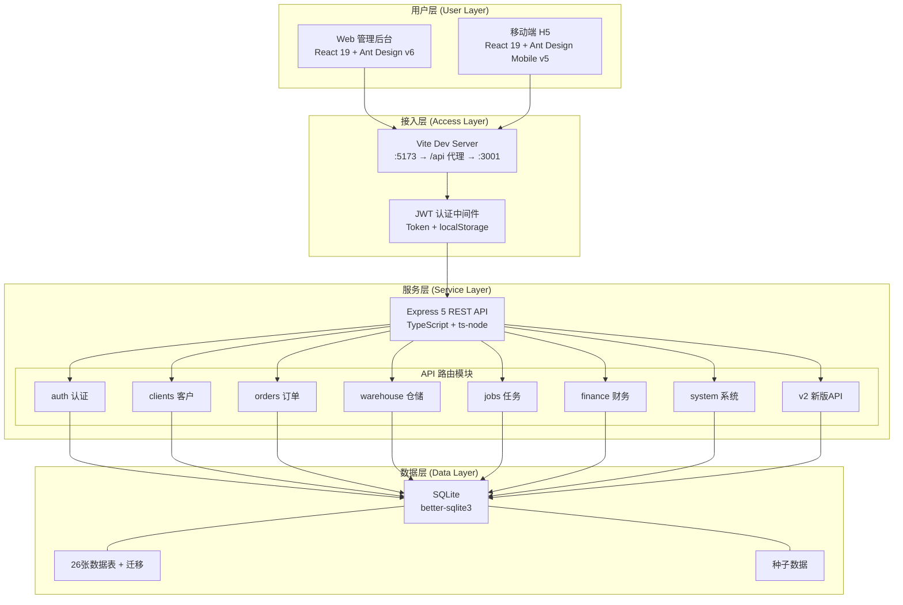
```mermaid
graph TB
    subgraph 用户层["用户层 (User Layer)"]
        WEB["Web 管理后台<br/>React 19 + Ant Design v6"]
        MOBILE["移动端 H5<br/>React 19 + Ant Design Mobile v5"]
    end

    subgraph 接入层["接入层 (Access Layer)"]
        VITE["Vite Dev Server<br/>:5173 → /api 代理 → :3001"]
        AUTH["JWT 认证中间件<br/>Token + localStorage"]
    end

    subgraph 服务层["服务层 (Service Layer)"]
        EXPRESS["Express 5 REST API<br/>TypeScript + ts-node"]
        subgraph 路由模块["API 路由模块"]
            R_AUTH["auth 认证"]
            R_CLIENT["clients 客户"]
            R_ORDER["orders 订单"]
            R_WH["warehouse 仓储"]
            R_JOB["jobs 任务"]
            R_FIN["finance 财务"]
            R_SYS["system 系统"]
            R_V2["v2 新版API"]
        end
    end

    subgraph 数据层["数据层 (Data Layer)"]
        SQLITE["SQLite<br/>better-sqlite3"]
        SCHEMA["26张数据表 + 迁移"]
        SEED["种子数据"]
    end

    WEB --> VITE
    MOBILE --> VITE
    VITE --> AUTH
    AUTH --> EXPRESS
    EXPRESS --> R_AUTH & R_CLIENT & R_ORDER & R_WH & R_JOB & R_FIN & R_SYS & R_V2
    R_AUTH & R_CLIENT & R_ORDER & R_WH & R_JOB & R_FIN & R_SYS & R_V2 --> SQLITE
    SQLITE --- SCHEMA & SEED
```

### 2.2 前端导航架构

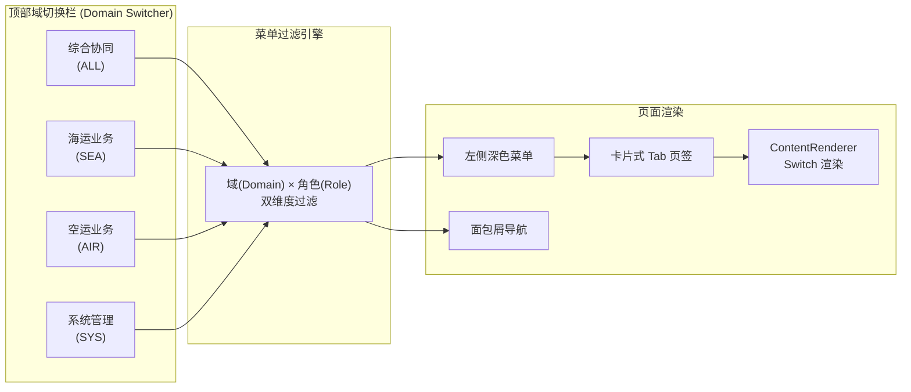
```mermaid
graph LR
    subgraph 顶部域切换["顶部域切换栏 (Domain Switcher)"]
        ALL["综合协同<br/>(ALL)"]
        SEA["海运业务<br/>(SEA)"]
        AIR["空运业务<br/>(AIR)"]
        SYS["系统管理<br/>(SYS)"]
    end

    subgraph 过滤引擎["菜单过滤引擎"]
        FILTER["域(Domain) × 角色(Role)<br/>双维度过滤"]
    end

    subgraph 渲染["页面渲染"]
        MENU["左侧深色菜单"]
        TABS["卡片式 Tab 页签"]
        BREAD["面包屑导航"]
        CONTENT["ContentRenderer<br/>Switch 渲染"]
    end

    ALL & SEA & AIR & SYS --> FILTER
    FILTER --> MENU --> TABS --> CONTENT
    FILTER --> BREAD
```

### 2.3 认证流程

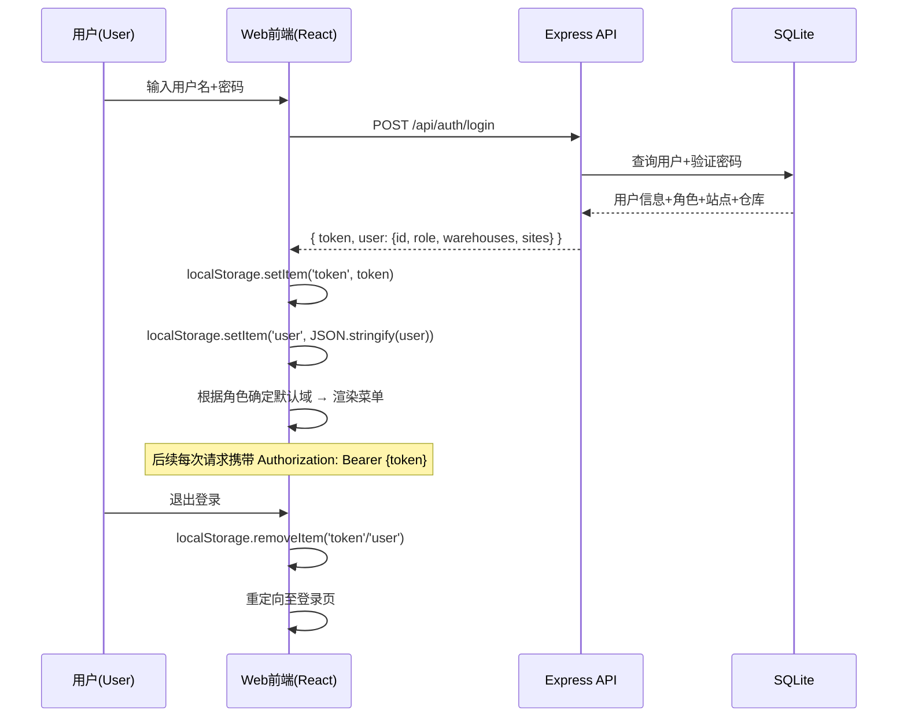
```mermaid
sequenceDiagram
    participant 用户 as 用户(User)
    participant 前端 as Web前端(React)
    participant 后端 as Express API
    participant DB as SQLite

    用户->>前端: 输入用户名+密码
    前端->>后端: POST /api/auth/login
    后端->>DB: 查询用户+验证密码
    DB-->>后端: 用户信息+角色+站点+仓库
    后端-->>前端: { token, user: {id, role, warehouses, sites} }
    前端->>前端: localStorage.setItem('token', token)
    前端->>前端: localStorage.setItem('user', JSON.stringify(user))
    前端->>前端: 根据角色确定默认域 → 渲染菜单
    
    Note over 前端: 后续每次请求携带 Authorization: Bearer {token}
    
    用户->>前端: 退出登录
    前端->>前端: localStorage.removeItem('token'/'user')
    前端->>前端: 重定向至登录页
```

---

## 3. 业务域与模块架构

```mermaid
graph TB
    subgraph ALL_DOMAIN["综合协同域 (ALL)"]
        DASH["工作台<br/>Dashboard"]
        FIN["财务中心<br/>Finance"]
        ANA["经营分析<br/>Analytics"]
    end

    subgraph SEA_AIR["海运/空运业务域 (SEA/AIR)"]
        CRM["客户中心<br/>CRM"]
        OMS["订单中心<br/>OMS"]
        WMS_O["起运国仓储<br/>WMS Origin"]
        TMS_O["起运国办<br/>TMS POL"]
        TMS_D["到达国办<br/>TMS POD"]
        WMS_D["到达国仓储<br/>WMS Dest"]
    end

    subgraph SYS_DOMAIN["系统管理域 (SYS)"]
        ORG["组织管理"]
        USER["用户管理"]
        ROLE["角色权限"]
        BASE["基础设置<br/>(10个子模块)"]
        WF["流程管理"]
        SAL["薪资设置"]
        MSG["消息通知"]
    end

    CRM -->|创建订单| OMS
    OMS -->|快递到仓| WMS_O
    WMS_O -->|执行任务(出库发运)| TMS_O
    TMS_O -->|运输到达| TMS_D
    TMS_D -->|入库分拨| WMS_D
    WMS_D -->|配送签收| FIN
    FIN -->|数据汇总| ANA
```

---

## 4. 角色权限体系

### 4.1 角色定义（8个业务角色 + 1个预留角色）

| 角色编码 | 角色名称 | 英文名 | 站点范围 | 可见域 | 状态 |
|---------|---------|--------|---------|--------|------|
| ADMIN | 系统管理员 | System Admin | 全站点(ALL_SITE) | ALL/SEA/AIR/SYS | 使用中 |
| BOSS | 管理层 | Boss | 全站点(ALL_SITE) | ALL | 使用中 |
| SALES | 销售人员 | Sales | 分配站点(ASSIGNED_SITE) | SEA/AIR | 使用中 |
| WAREHOUSE_CN | 起运国仓管 | Origin Warehouse | 分配站点 | SEA/AIR | 使用中 |
| OPS_CN | 起运国操作 | Origin Operations | 分配站点 | SEA/AIR | 使用中 |
| OPS_US | 到达国操作 | Dest Operations | 分配站点 | SEA/AIR | 使用中 |
| WAREHOUSE_US | 到达国仓管 | Dest Warehouse | 分配站点 | SEA/AIR | 使用中 |
| FINANCE | 财务人员 | Finance | 分配站点 | ALL | 使用中 |
| DRIVER | 司机 | Driver | 分配站点 | 无 | **预留**（角色管理中存在，但当前无业务域可见性，暂不参与业务流程） |

### 4.2 模块权限矩阵

| 模块 | ADMIN | BOSS | SALES | WH_CN | OPS_CN | OPS_US | WH_US | FINANCE |
|------|-------|------|-------|-------|--------|--------|-------|---------|
| 工作台 | ✅ | ✅ | ✅ | ✅ | ✅ | ✅ | ✅ | ✅ |
| 客户中心 | ✅ | | ✅ | | ✅ | | | |
| 订单中心 | ✅ | | ✅ | ✅ | ✅ | ✅ | ✅ | |
| 起运国仓储 | ✅ | | | ✅ | ✅ | | | |
| 起运国办 | ✅ | | ✅(部分) | | ✅ | | | |
| 到达国办 | ✅ | | | | | ✅ | | |
| 到达国仓储 | ✅ | | | | | ✅ | ✅ | |
| 财务中心 | ✅ | ✅ | | | | | | ✅ |
| 经营分析 | ✅ | ✅ | | | | | | |
| 系统管理 | ✅ | | | | | | | |

### 4.3 角色与业务操作权限

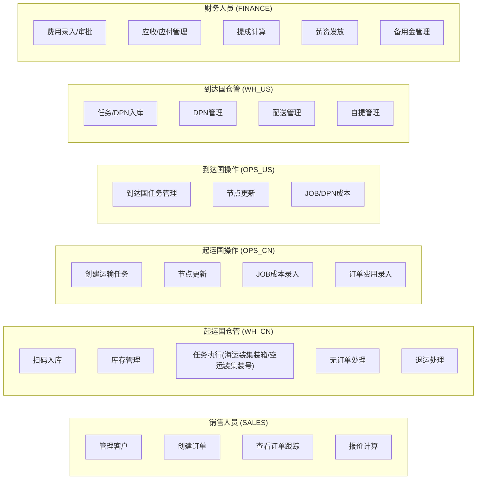
```mermaid
graph LR
    subgraph 销售["销售人员 (SALES)"]
        S1["管理客户"]
        S2["创建订单"]
        S3["查看订单跟踪"]
        S4["报价计算"]
    end

    subgraph 起运仓["起运国仓管 (WH_CN)"]
        W1["扫码入库"]
        W2["库存管理"]
        W3["任务执行(海运装集装箱/空运装集装号)"]
        W4["无订单处理"]
        W5["退运处理"]
    end

    subgraph 起运操作["起运国操作 (OPS_CN)"]
        O1["创建运输任务"]
        O2["节点更新"]
        O3["JOB成本录入"]
        O4["订单费用录入"]
    end

    subgraph 到达操作["到达国操作 (OPS_US)"]
        D1["到达国任务管理"]
        D2["节点更新"]
        D3["JOB/DPN成本"]
    end

    subgraph 到达仓["到达国仓管 (WH_US)"]
        DW1["任务/DPN入库"]
        DW2["DPN管理"]
        DW3["配送管理"]
        DW4["自提管理"]
    end

    subgraph 财务["财务人员 (FINANCE)"]
        F1["费用录入/审批"]
        F2["应收/应付管理"]
        F3["提成计算"]
        F4["薪资发放"]
        F5["备用金管理"]
    end
```

---

## 5. 核心业务实体关系图

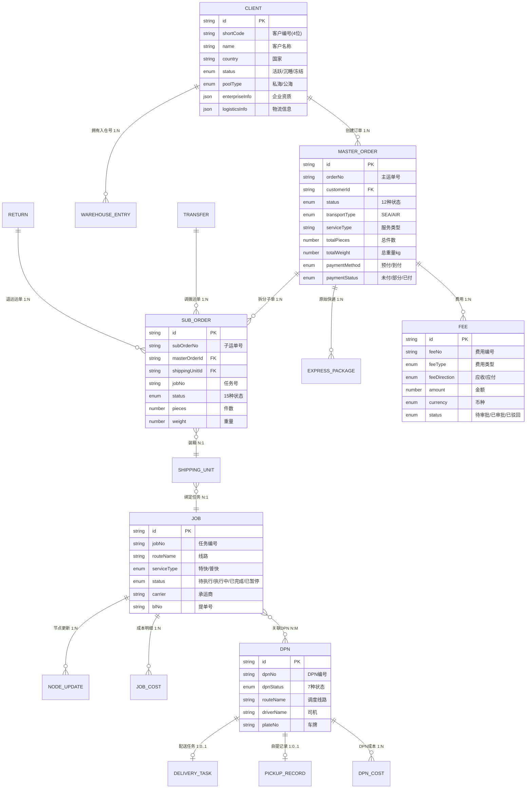
```mermaid
erDiagram
    CLIENT ||--o{ MASTER_ORDER : "创建订单 1:N"
    CLIENT ||--o{ WAREHOUSE_ENTRY : "拥有入仓号 1:N"
    
    MASTER_ORDER ||--o{ SUB_ORDER : "拆分子单 1:N"
    MASTER_ORDER ||--o{ EXPRESS_PACKAGE : "原始快递 1:N"
    MASTER_ORDER ||--o{ FEE : "费用 1:N"
    
    SUB_ORDER }o--|| SHIPPING_UNIT : "装箱 N:1"
    SHIPPING_UNIT }o--|| JOB : "绑定任务 N:1"
    
    JOB ||--o{ NODE_UPDATE : "节点更新 1:N"
    JOB ||--o{ JOB_COST : "成本明细 1:N"
    JOB }o--o{ DPN : "关联DPN N:M"
    
    DPN ||--o| DELIVERY_TASK : "配送任务 1:0..1"
    DPN ||--o| PICKUP_RECORD : "自提记录 1:0..1"
    DPN ||--o{ DPN_COST : "DPN成本 1:N"
    
    TRANSFER ||--o{ SUB_ORDER : "调拨运单 1:N"
    RETURN ||--o{ SUB_ORDER : "退运运单 1:N"
    
    CLIENT {
        string id PK
        string shortCode "客户编号(4位)"
        string name "客户名称"
        string country "国家"
        enum status "活跃/沉睡/冻结"
        enum poolType "私海/公海"
        json enterpriseInfo "企业资质"
        json logisticsInfo "物流信息"
    }
    
    MASTER_ORDER {
        string id PK
        string orderNo "主运单号"
        string customerId FK
        enum status "12种状态"
        enum transportType "SEA/AIR"
        string serviceType "服务类型"
        number totalPieces "总件数"
        number totalWeight "总重量kg"
        enum paymentMethod "预付/到付"
        enum paymentStatus "未付/部分/已付"
    }
    
    SUB_ORDER {
        string id PK
        string subOrderNo "子运单号"
        string masterOrderId FK
        string shippingUnitId FK
        string jobNo "任务号"
        enum status "15种状态"
        number pieces "件数"
        number weight "重量"
    }
    
    JOB {
        string id PK
        string jobNo "任务编号"
        string routeName "线路"
        enum serviceType "特快/普快"
        enum status "待执行/执行中/已完成/已暂停"
        string carrier "承运商"
        string blNo "提单号"
    }
    
    DPN {
        string id PK
        string dpnNo "DPN编号"
        enum dpnStatus "7种状态"
        string routeName "调度线路"
        string driverName "司机"
        string plateNo "车牌"
    }
    
    FEE {
        string id PK
        string feeNo "费用编号"
        enum feeType "费用类型"
        enum feeDirection "应收/应付"
        number amount "金额"
        enum currency "币种"
        enum status "待审批/已审批/已驳回"
    }
```

---

## 6. 端到端业务主流程图

### 6.1 跨境物流全链路流程


```mermaid
graph LR
    subgraph 获客["1. 获客<br/>(CRM)"]
        A1["客户录入/认领"]
        A2["客户资质维护"]
    end

    subgraph 接单["2. 接单<br/>(OMS)"]
        B1["创建主订单"]
        B2["关联快递包裹"]
        B3["订单拆分"]
    end

    subgraph 起运仓["3. 起运国仓库<br/>(WMS Origin)"]
        C1["快递入库<br/>(扫码称重)"]
        C2["库存管理"]
        C3["任务执行(海运装集装箱/空运装集装号)"]
        C4["封箱 → 绑定JOB<br/>→ 执行任务(=出库发运)"]
    end

    subgraph 起运操作["4. 起运国操作<br/>(TMS POL)"]
        D1["创建运输任务(JOB)"]
        D2["节点更新<br/>(已离库→报关→放行→已起运)"]
        D3["JOB成本录入"]
    end

    subgraph 运输["5. 国际运输"]
        E1["海运/空运<br/>在途追踪"]
    end

    subgraph 到达操作["6. 到达国操作<br/>(TMS POD)"]
        F1["到港节点更新"]
        F2["清关放行"]
        F3["JOB/DPN成本"]
    end

    subgraph 到达仓["7. 到达国仓库<br/>(WMS Dest)"]
        G1["任务入库(按JOB)"]
        G2a["直接配送/自提"]
        G2b["DPN站点调拨<br/>(主仓→卫星站)"]
        G3["DPN入库(卫星站接收)"]
        G4["签收完成"]
    end

    subgraph 财务["8. 财务结算<br/>(Finance)"]
        H1["费用录入/审批"]
        H2["应收(向客户收)"]
        H3["应付(付供应商)"]
        H4["毛利核算"]
    end

    A1 --> A2 --> B1 --> B2 --> B3
    B3 --> C1 --> C2 --> C3 --> C4
    C4 --> D1 --> D2 --> D3
    D2 --> E1
    E1 --> F1 --> F2 --> F3
    F2 --> G1
    G1 --> G2a --> G4
    G1 --> G2b --> G3 --> G2a
    G4 --> H1 --> H2 & H3 --> H4
```

### 6.2 订单生命周期（从创建到签收）

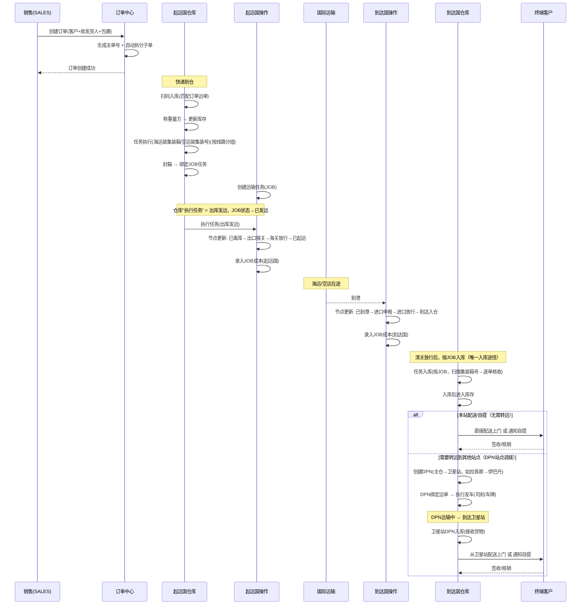
```mermaid
sequenceDiagram
    participant 销售 as 销售(SALES)
    participant OMS as 订单中心
    participant 起运仓 as 起运国仓库
    participant 起运操作 as 起运国操作
    participant 运输 as 国际运输
    participant 到达操作 as 到达国操作
    participant 到达仓 as 到达国仓库
    participant 客户 as 终端客户

    销售->>OMS: 创建订单(客户+收发货人+包裹)
    OMS->>OMS: 生成主单号 + 自动拆分子单
    OMS-->>销售: 订单创建成功

    Note over 起运仓: 快递到仓
    起运仓->>起运仓: 扫码入库(匹配订单运单)
    起运仓->>起运仓: 称重量方 → 更新库存
    起运仓->>起运仓: 任务执行(海运装集装箱/空运装集装号)(按线路分组)
    起运仓->>起运仓: 封箱 → 绑定JOB任务

    起运操作->>起运操作: 创建运输任务(JOB)
    
    Note over 起运仓,起运操作: 仓库"执行任务" = 出库发运，JOB状态→已发运
    起运仓->>起运操作: 执行任务(出库发运)
    起运操作->>起运操作: 节点更新: 已离库→出口报关→海关放行→已起运
    起运操作->>起运操作: 录入JOB成本(起运国)

    Note over 运输: 海运/空运在途
    运输-->>到达操作: 到港

    到达操作->>到达操作: 节点更新: 已到港→进口申报→进口放行→到达入仓
    到达操作->>到达操作: 录入JOB成本(到达国)

    Note over 到达仓: 清关放行后，按JOB入库（唯一入库途径）
    到达仓->>到达仓: 任务入库(按JOB，扫描集装箱号→逐单核收)
    到达仓->>到达仓: 入库后进入库存

    alt 本站配送/自提（无需转运）
        到达仓->>客户: 直接配送上门 或 通知自提
        客户-->>到达仓: 签收/核销
    else 需要转运到其他站点（DPN站点调拨）
        到达仓->>到达仓: 创建DPN(主仓→卫星站，如拉各斯→伊巴丹)
        到达仓->>到达仓: DPN绑定运单 → 执行发车(司机/车牌)
        Note over 到达仓: DPN运输中 → 到达卫星站
        到达仓->>到达仓: 卫星站DPN入库(接收货物)
        到达仓->>客户: 从卫星站配送上门 或 通知自提
        客户-->>到达仓: 签收/核销
    end
```

---

## 7. 各模块业务流程图

### 7.1 CRM 客户管理流程

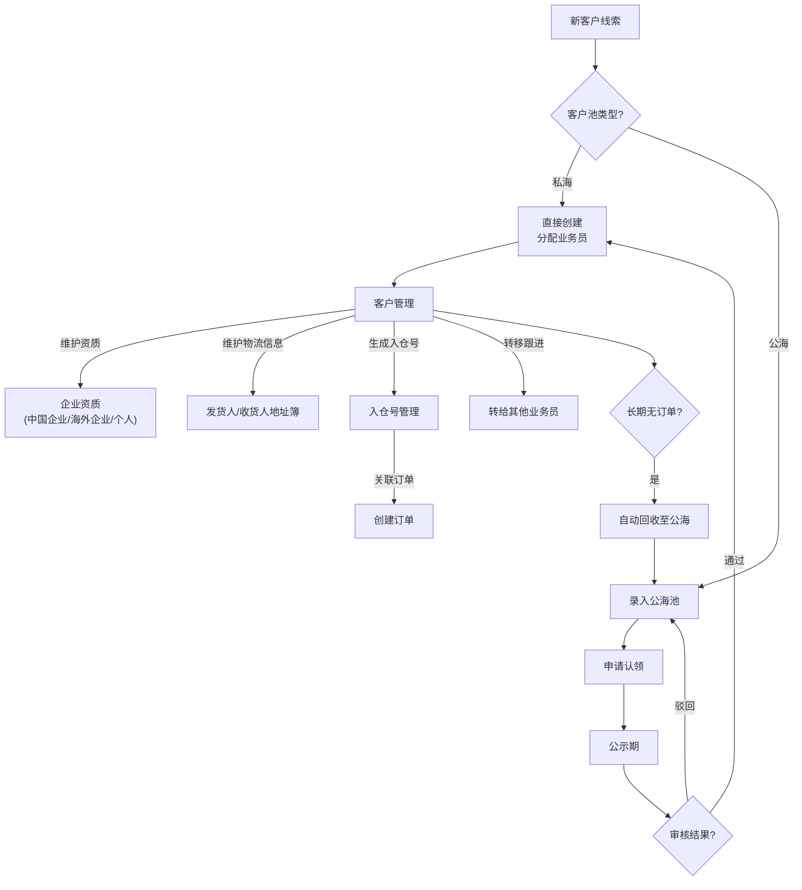
```mermaid
graph TD
    START["新客户线索"] --> POOL{"客户池类型?"}
    POOL -->|私海| PRIVATE["直接创建<br/>分配业务员"]
    POOL -->|公海| PUBLIC["录入公海池"]
    
    PUBLIC --> CLAIM["申请认领"]
    CLAIM --> NOTICE["公示期"]
    NOTICE --> REVIEW{"审核结果?"}
    REVIEW -->|通过| PRIVATE
    REVIEW -->|驳回| PUBLIC
    
    PRIVATE --> MANAGE["客户管理"]
    MANAGE --> |维护资质| ENTERPRISE["企业资质<br/>(中国企业/海外企业/个人)"]
    MANAGE --> |维护物流信息| LOGISTICS["发货人/收货人地址簿"]
    MANAGE --> |生成入仓号| ENTRY["入仓号管理"]
    MANAGE --> |转移跟进| TRANSFER["转给其他业务员"]
    
    ENTRY --> |关联订单| ORDER["创建订单"]
    
    MANAGE --> DORMANT{"长期无订单?"}
    DORMANT -->|是| AUTO_RELEASE["自动回收至公海"]
    AUTO_RELEASE --> PUBLIC
```

### 7.2 起运国仓储流程

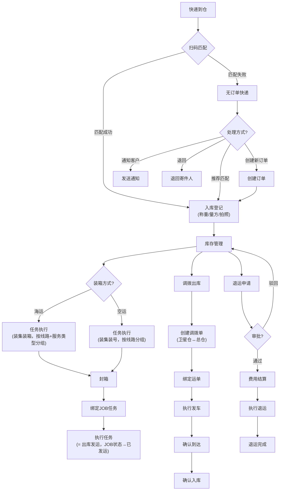
```mermaid
graph TD
    EXPRESS["快递到仓"] --> SCAN{"扫码匹配"}
    SCAN -->|匹配成功| INBOUND["入库登记<br/>(称重/量方/拍照)"]
    SCAN -->|匹配失败| NO_ORDER["无订单快递"]
    
    NO_ORDER --> MATCH{"处理方式?"}
    MATCH -->|推荐匹配| INBOUND
    MATCH -->|创建新订单| CREATE_ORDER["创建订单"] --> INBOUND
    MATCH -->|通知客户| NOTIFY["发送通知"]
    MATCH -->|退回| RETURN_NO["退回寄件人"]
    
    INBOUND --> STOCK["库存管理"]
    
    STOCK --> PACK{"装箱方式?"}
    PACK -->|海运| CONTAINER["任务执行<br/>(装集装箱，按线路+服务类型分组)"]
    PACK -->|空运| PALLET["任务执行<br/>(装集装号，按线路分组)"]
    
    CONTAINER --> SEAL["封箱"] --> BIND_JOB["绑定JOB任务"]
    PALLET --> SEAL
    BIND_JOB --> EXEC_TASK["执行任务<br/>(= 出库发运，JOB状态→已发运)"]
    
    STOCK --> TRANSFER_OUT["调拨出库"]
    TRANSFER_OUT --> CREATE_TRANSFER["创建调拨单<br/>(卫星仓↔总仓)"]
    CREATE_TRANSFER --> BIND_WB["绑定运单"] --> EXECUTE["执行发车"]
    EXECUTE --> ARRIVE["确认到达"] --> TRANSFER_IN["确认入库"]
    
    STOCK --> RETURN["退运申请"]
    RETURN --> APPROVE{"审批?"}
    APPROVE -->|通过| SETTLE["费用结算"]
    APPROVE -->|驳回| STOCK
    SETTLE --> EXEC_RETURN["执行退运"] --> COMPLETE["退运完成"]
```

### 7.3 到达国仓储与配送流程

> **核心逻辑说明**:
> - 清关放行后，**只有按JOB入库**一种途径（任务入库）
> - **DPN入库**对应的是到达国内部**站点间调拨**场景：入库后需要将部分运单从主仓转运到卫星站进行最后的配送或自提
> - 一般情况下，入库后直接在本站配送或自提；如需转运到其他站点，才创建DPN

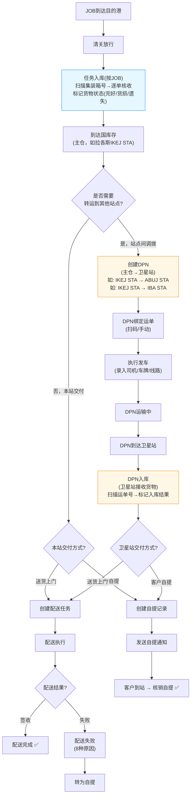
```mermaid
graph TD
    JOB_ARRIVE["JOB到达目的港"] --> CUSTOMS["清关放行"]
    CUSTOMS --> JOB_INBOUND["任务入库(按JOB)<br/>扫描集装箱号→逐单核收<br/>标记货物状态(完好/货损/遗失)"]
    
    JOB_INBOUND --> STOCK_DEST["到达国库存<br/>(主仓，如拉各斯IKEJ STA)"]
    
    STOCK_DEST --> NEED_TRANSFER{"是否需要<br/>转运到其他站点?"}
    
    NEED_TRANSFER -->|否，本站交付| LOCAL_DELIVERY{"本站交付方式?"}
    LOCAL_DELIVERY -->|送货上门| DELIVERY["创建配送任务"]
    LOCAL_DELIVERY -->|客户自提| PICKUP["创建自提记录"]
    
    NEED_TRANSFER -->|是，站点间调拨| CREATE_DPN["创建DPN<br/>(主仓→卫星站)<br/>如: IKEJ STA → ABUJ STA<br/>如: IKEJ STA → IBA STA"]
    CREATE_DPN --> BIND_SUB["DPN绑定运单<br/>(扫码/手动)"]
    BIND_SUB --> DISPATCH["执行发车<br/>(录入司机/车牌/线路)"]
    DISPATCH --> DPN_TRANSIT["DPN运输中"]
    DPN_TRANSIT --> DPN_ARRIVE["DPN到达卫星站"]
    DPN_ARRIVE --> DPN_INBOUND["DPN入库<br/>(卫星站接收货物)<br/>扫描运单号→标记入库结果"]
    
    DPN_INBOUND --> SATELLITE_DELIVERY{"卫星站交付方式?"}
    SATELLITE_DELIVERY -->|送货上门| DELIVERY
    SATELLITE_DELIVERY -->|客户自提| PICKUP
    
    DELIVERY --> DELIVER_EXEC["配送执行"]
    DELIVER_EXEC --> DELIVER_RESULT{"配送结果?"}
    DELIVER_RESULT -->|签收| SIGNED["配送完成 ✅"]
    DELIVER_RESULT -->|失败| FAILED["配送失败<br/>(8种原因)"]
    FAILED --> CONVERT["转为自提"]
    
    PICKUP --> NOTIFY_PICKUP["发送自提通知"]
    NOTIFY_PICKUP --> VERIFY["客户到站 → 核销自提 ✅"]

    style JOB_INBOUND fill:#e6f7ff,stroke:#1890ff
    style DPN_INBOUND fill:#fff7e6,stroke:#fa8c16
    style CREATE_DPN fill:#fff7e6,stroke:#fa8c16
```

### 7.4 费用与成本审核流程

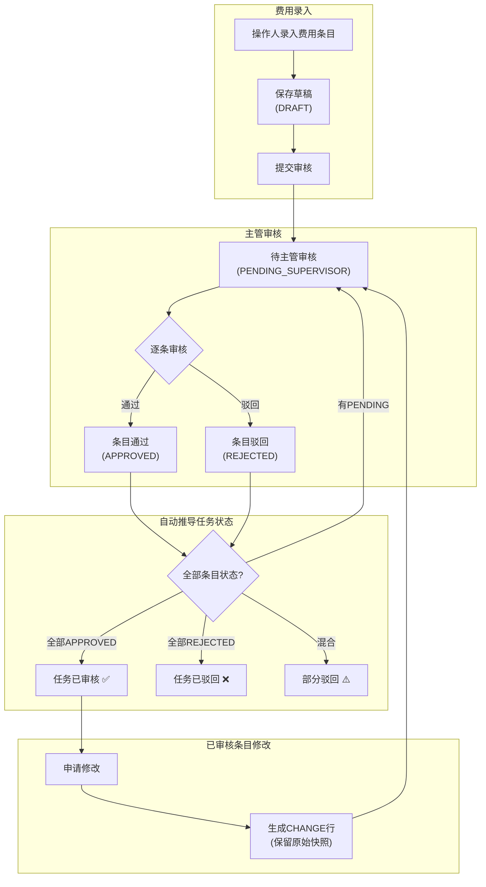
```mermaid
graph TD
    subgraph 录入["费用录入"]
        INPUT["操作人录入费用条目"]
        INPUT --> DRAFT["保存草稿<br/>(DRAFT)"]
        DRAFT --> SUBMIT["提交审核"]
    end

    subgraph 审核["主管审核"]
        SUBMIT --> PENDING["待主管审核<br/>(PENDING_SUPERVISOR)"]
        PENDING --> REVIEW{"逐条审核"}
        REVIEW -->|通过| ITEM_APPROVED["条目通过<br/>(APPROVED)"]
        REVIEW -->|驳回| ITEM_REJECTED["条目驳回<br/>(REJECTED)"]
    end

    subgraph 推导["自动推导任务状态"]
        ITEM_APPROVED --> DERIVE{"全部条目状态?"}
        ITEM_REJECTED --> DERIVE
        DERIVE -->|全部APPROVED| TASK_APPROVED["任务已审核 ✅"]
        DERIVE -->|全部REJECTED| TASK_REJECTED["任务已驳回 ❌"]
        DERIVE -->|混合| TASK_PARTIAL["部分驳回 ⚠️"]
        DERIVE -->|有PENDING| PENDING
    end

    subgraph 修改["已审核条目修改"]
        TASK_APPROVED --> CHANGE_REQ["申请修改"]
        CHANGE_REQ --> CHANGE_LINE["生成CHANGE行<br/>(保留原始快照)"]
        CHANGE_LINE --> PENDING
    end
```

---

## 8. 状态机流转图

### 8.1 主订单状态 (MasterOrder Status)

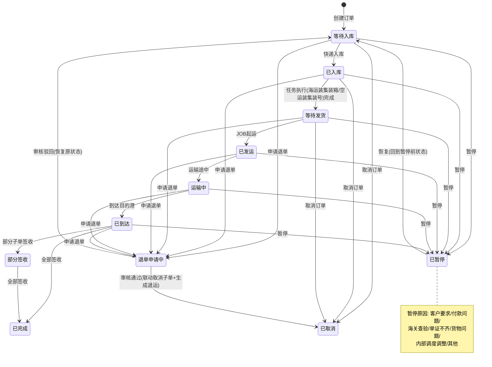
```mermaid
stateDiagram-v2
    [*] --> 等待入库: 创建订单
    等待入库 --> 已入库: 快递入库
    已入库 --> 等待发货: 任务执行(海运装集装箱/空运装集装号)完成
    等待发货 --> 已发运: JOB起运
    已发运 --> 运输中: 运输途中
    运输中 --> 已到达: 到达目的港
    已到达 --> 部分签收: 部分子单签收
    已到达 --> 已完成: 全部签收
    部分签收 --> 已完成: 全部签收

    等待入库 --> 已取消: 取消订单
    已入库 --> 已取消: 取消订单
    等待发货 --> 已取消: 取消订单

    等待入库 --> 退单申请中: 申请退单
    已入库 --> 退单申请中: 申请退单
    等待发货 --> 退单申请中: 申请退单
    已发运 --> 退单申请中: 申请退单
    运输中 --> 退单申请中: 申请退单
    已到达 --> 退单申请中: 申请退单
    退单申请中 --> 已取消: 审核通过(联动取消子单+生成退运)
    退单申请中 --> 等待入库: 审核驳回(恢复原状态)

    等待入库 --> 已暂停: 暂停
    已入库 --> 已暂停: 暂停
    等待发货 --> 已暂停: 暂停
    已发运 --> 已暂停: 暂停
    运输中 --> 已暂停: 暂停
    已到达 --> 已暂停: 暂停
    已暂停 --> 等待入库: 恢复(回到暂停前状态)

    note right of 已暂停
        暂停原因: 客户要求/付款问题/
        海关查验/单证不齐/货物问题/
        内部调度调整/其他
    end note
```

### 8.2 子订单状态 (SubOrder Status)

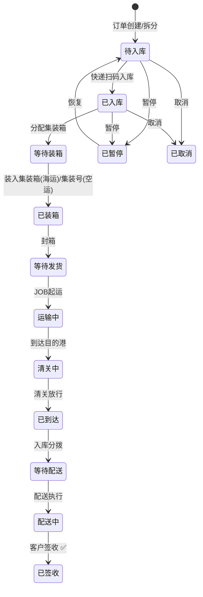
```mermaid
stateDiagram-v2
    [*] --> 待入库: 订单创建/拆分
    待入库 --> 已入库: 快递扫码入库
    已入库 --> 等待装箱: 分配集装箱
    等待装箱 --> 已装箱: 装入集装箱(海运)/集装号(空运)
    已装箱 --> 等待发货: 封箱
    等待发货 --> 运输中: JOB起运
    运输中 --> 清关中: 到达目的港
    清关中 --> 已到达: 清关放行
    已到达 --> 等待配送: 入库分拨
    等待配送 --> 配送中: 配送执行
    配送中 --> 已签收: 客户签收 ✅

    待入库 --> 已暂停: 暂停
    已入库 --> 已暂停: 暂停
    已暂停 --> 待入库: 恢复

    待入库 --> 已取消: 取消
    已入库 --> 已取消: 取消
```

### 8.3 运输任务状态 (Job Status)

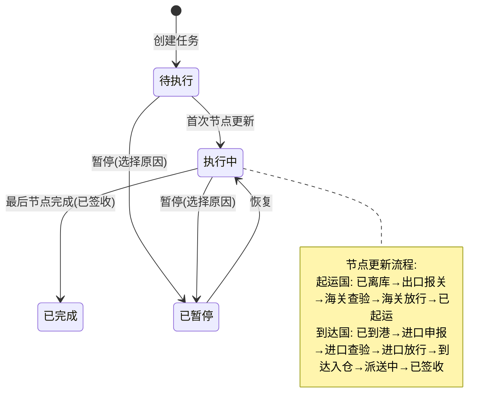
```mermaid
stateDiagram-v2
    [*] --> 待执行: 创建任务
    待执行 --> 执行中: 首次节点更新
    执行中 --> 已完成: 最后节点完成(已签收)
    
    待执行 --> 已暂停: 暂停(选择原因)
    执行中 --> 已暂停: 暂停(选择原因)
    已暂停 --> 执行中: 恢复

    note right of 执行中
        节点更新流程:
        起运国: 已离库→出口报关→海关查验→海关放行→已起运
        到达国: 已到港→进口申报→进口查验→进口放行→到达入仓→派送中→已签收
    end note
```

### 8.4 退运状态 (Return Status)

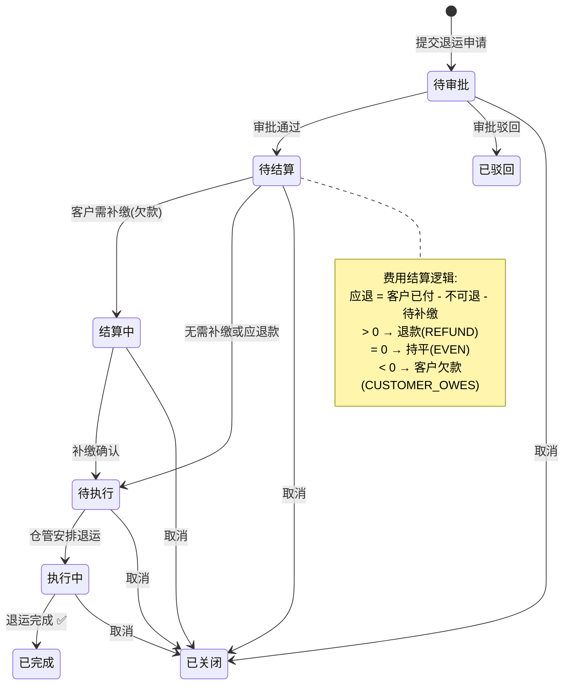
```mermaid
stateDiagram-v2
    [*] --> 待审批: 提交退运申请
    待审批 --> 待结算: 审批通过
    待审批 --> 已驳回: 审批驳回

    待结算 --> 结算中: 客户需补缴(欠款)
    待结算 --> 待执行: 无需补缴或应退款
    结算中 --> 待执行: 补缴确认

    待执行 --> 执行中: 仓管安排退运
    执行中 --> 已完成: 退运完成 ✅

    待审批 --> 已关闭: 取消
    待结算 --> 已关闭: 取消
    结算中 --> 已关闭: 取消
    待执行 --> 已关闭: 取消
    执行中 --> 已关闭: 取消

    note right of 待结算
        费用结算逻辑:
        应退 = 客户已付 - 不可退 - 待补缴
        > 0 → 退款(REFUND)
        = 0 → 持平(EVEN)
        < 0 → 客户欠款(CUSTOMER_OWES)
    end note
```

### 8.5 DPN 状态 (DPN Status) — 到达国站点间调拨

> DPN 是到达国内部站点间调拨场景（如拉各斯主仓→伊巴丹卫星站），不是国际运输入库途径。

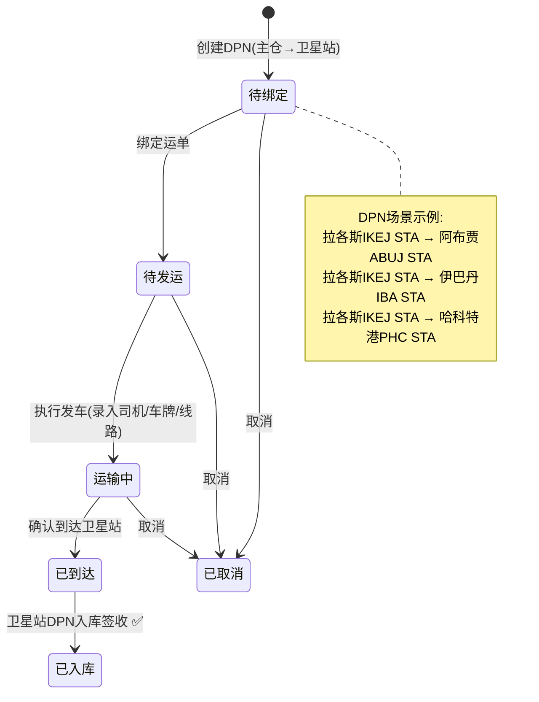
```mermaid
stateDiagram-v2
    [*] --> 待绑定: 创建DPN(主仓→卫星站)
    待绑定 --> 待发运: 绑定运单
    待发运 --> 运输中: 执行发车(录入司机/车牌/线路)
    运输中 --> 已到达: 确认到达卫星站
    已到达 --> 已入库: 卫星站DPN入库签收 ✅

    待绑定 --> 已取消: 取消
    待发运 --> 已取消: 取消
    运输中 --> 已取消: 取消

    note right of 待绑定
        DPN场景示例:
        拉各斯IKEJ STA → 阿布贾ABUJ STA
        拉各斯IKEJ STA → 伊巴丹IBA STA
        拉各斯IKEJ STA → 哈科特港PHC STA
    end note
```

### 8.6 配送任务状态 (Delivery Task Status)

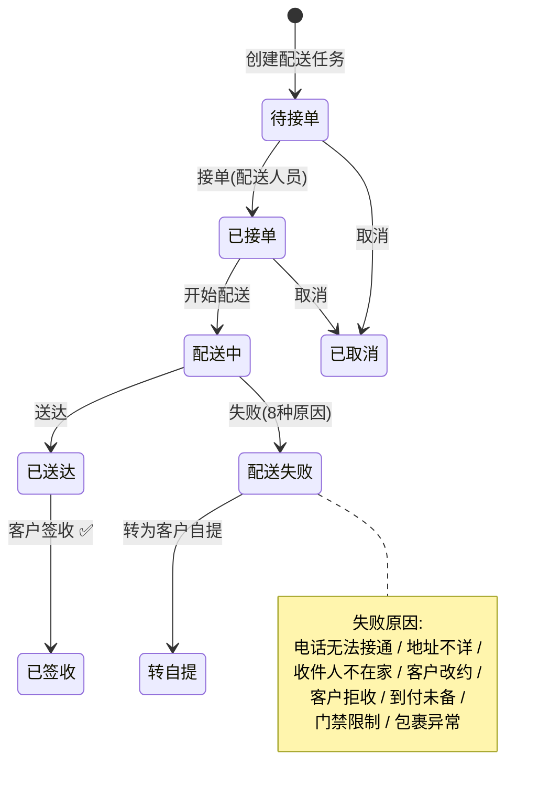
```mermaid
stateDiagram-v2
    [*] --> 待接单: 创建配送任务
    待接单 --> 已接单: 接单(配送人员)
    已接单 --> 配送中: 开始配送
    配送中 --> 已送达: 送达
    已送达 --> 已签收: 客户签收 ✅
    
    配送中 --> 配送失败: 失败(8种原因)
    配送失败 --> 转自提: 转为客户自提

    待接单 --> 已取消: 取消
    已接单 --> 已取消: 取消

    note right of 配送失败
        失败原因:
        电话无法接通 / 地址不详 /
        收件人不在家 / 客户改约 /
        客户拒收 / 到付未备 /
        门禁限制 / 包裹异常
    end note
```

### 8.7 费用审核状态 (Fee Review Status)

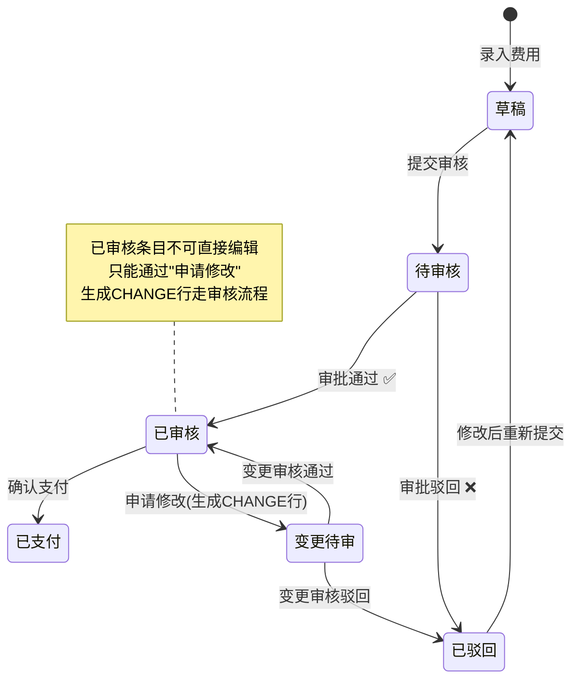
```mermaid
stateDiagram-v2
    [*] --> 草稿: 录入费用
    草稿 --> 待审核: 提交审核
    待审核 --> 已审核: 审批通过 ✅
    待审核 --> 已驳回: 审批驳回 ❌
    
    已审核 --> 已支付: 确认支付

    已审核 --> 变更待审: 申请修改(生成CHANGE行)
    变更待审 --> 已审核: 变更审核通过
    变更待审 --> 已驳回: 变更审核驳回

    已驳回 --> 草稿: 修改后重新提交

    note left of 已审核
        已审核条目不可直接编辑
        只能通过"申请修改"
        生成CHANGE行走审核流程
    end note
```

### 8.8 备用金状态 (Petty Cash Status)

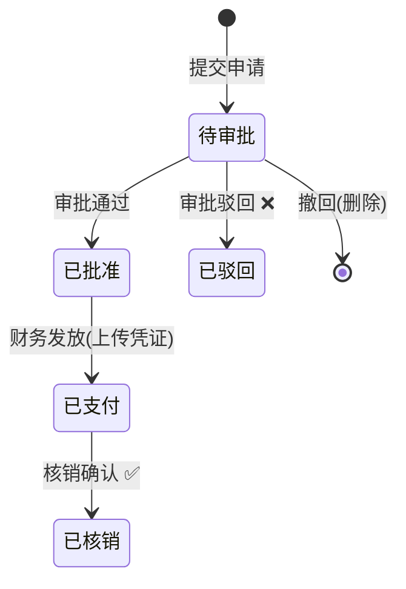
```mermaid
stateDiagram-v2
    [*] --> 待审批: 提交申请
    待审批 --> 已批准: 审批通过
    待审批 --> 已驳回: 审批驳回 ❌
    待审批 --> [*]: 撤回(删除)
    
    已批准 --> 已支付: 财务发放(上传凭证)
    已支付 --> 已核销: 核销确认 ✅
```

### 8.9 调拨单状态 (Transfer Status)

```mermaid
stateDiagram-v2
    [*] --> 待发运: 创建调拨单+绑定运单
    待发运 --> 运输中: 执行发车
    运输中 --> 已到达: 确认到达
    已到达 --> 已入库: 确认入库 ✅
    
    待发运 --> 已取消: 取消
```

### 8.10 入仓号状态 (Warehouse Entry Status)

```mermaid
stateDiagram-v2
    [*] --> 待使用: 生成入仓号
    待使用 --> 已关联: 关联订单
    已关联 --> 已入库: 货物入库 ✅
    待使用 --> 已失效: 手动作废 ❌
```

---

## 9. 数据流转逻辑图

### 9.1 订单数据流（从创建到签收的数据传递）

```mermaid
graph TD
    subgraph CRM["CRM 客户中心"]
        CLIENT_DATA["客户数据<br/>(发货人/收货人地址簿<br/>企业资质/入仓号)"]
    end

    subgraph OMS["OMS 订单中心"]
        ORDER_CREATE["创建订单<br/>↓ 自动生成"]
        MASTER["主订单 MasterOrder<br/>(orderNo, 客户, 收发货人<br/>包裹明细, 费用)"]
        SUB["子订单 SubOrder<br/>(subOrderNo, 拆分物品<br/>运输方式, 路线)"]
        PACKAGE["快递包裹 ExpressPackage<br/>(trackingNo, 快递公司<br/>重量, 件数)"]
    end

    subgraph WMS_O["WMS 起运国仓储"]
        INBOUND["入库记录<br/>(实重, 体积, 库位)"]
        STOCK_O["起运国库存<br/>(状态: 在库/已装箱/已出库)"]
        UNIT["集装箱(海运)/集装号(空运) ShippingUnit<br/>(unitNo, 装载订单列表<br/>重量/体积汇总)"]
    end

    subgraph TMS["TMS 运输管理"]
        JOB_DATA["运输任务 Job<br/>(jobNo, 承运商, 提单号<br/>线路, 节点记录)"]
        NODE["节点更新记录<br/>(12个物流节点<br/>时间+异常标记)"]
        COST_POL["起运国成本<br/>(费用类型+金额+供应商)"]
        COST_POD["到达国成本<br/>(费用类型+金额+NGN汇率)"]
    end

    subgraph WMS_D["WMS 到达国仓储"]
        INBOUND_D["到达国入库<br/>(货物状态: 完好/货损/遗失)"]
        STOCK_D["到达国库存<br/>(状态: 在库/待配送/待自提)"]
        DPN_DATA["DPN 派送单<br/>(dpnNo, 调度线路<br/>司机, 车牌)"]
        DELIVERY["配送任务<br/>(配送状态, 签收时间)"]
        PICKUP["自提记录<br/>(自提码, 通知状态)"]
    end

    subgraph FIN["财务中心"]
        FEE_DATA["费用记录<br/>(应收+应付, 多币种)"]
        RECEIVABLE["应收管理<br/>(客户收款, 账龄)"]
        PAYABLE["应付管理<br/>(供应商付款, 对账)"]
        PROFIT["毛利核算<br/>(应收-成本=毛利)"]
    end

    CLIENT_DATA -->|客户+地址簿| ORDER_CREATE
    ORDER_CREATE --> MASTER --> SUB & PACKAGE

    PACKAGE -->|扫码匹配| INBOUND
    SUB -->|订单关联| INBOUND
    INBOUND --> STOCK_O
    STOCK_O -->|装箱| UNIT
    UNIT -->|绑定| JOB_DATA

    JOB_DATA --> NODE
    JOB_DATA --> COST_POL
    JOB_DATA --> COST_POD

    JOB_DATA -->|到达| INBOUND_D
    INBOUND_D --> STOCK_D
    STOCK_D --> DPN_DATA
    DPN_DATA --> DELIVERY & PICKUP

    COST_POL & COST_POD -->|成本数据| FEE_DATA
    MASTER -->|应收费用| FEE_DATA
    FEE_DATA --> RECEIVABLE & PAYABLE
    RECEIVABLE & PAYABLE --> PROFIT
```

### 9.2 费用数据流（多来源汇总）

```mermaid
graph LR
    subgraph 费用来源["费用产生来源"]
        OMS_FEE["订单费用<br/>(OMS → 应收)"]
        JOB_COST_POL["JOB成本-起运国<br/>(TMS → 应付)"]
        JOB_COST_POD["JOB成本-到达国<br/>(TMS → 应付)"]
        ORDER_FEE["订单费用录入<br/>(TMS → 应收+应付)"]
        DPN_COST["DPN成本<br/>(TMS → 应付)"]
        AUTO_FEE["自动获取费用<br/>(订单/集装/任务)"]
        MANUAL_FEE["手动录入费用"]
    end

    subgraph 费用处理["费用处理流程"]
        FEE_POOL["费用池<br/>(FeeRecord)"]
        APPROVAL["费用审批<br/>(待审批→已审批/已驳回)"]
    end

    subgraph 费用汇总["费用汇总视图"]
        RECV["应收管理<br/>(按运单汇总<br/>收款登记)"]
        PAY["应付管理<br/>(按供应商汇总<br/>运费/报关/拖车对账)"]
        GROSS["毛利表<br/>(应收-成本=利润)"]
        JOB_PL["任务盈亏<br/>(按JOB汇总收支)"]
        COMMISSION["提成计算<br/>(4种方案)"]
    end

    OMS_FEE & JOB_COST_POL & JOB_COST_POD & ORDER_FEE & DPN_COST & AUTO_FEE & MANUAL_FEE --> FEE_POOL
    FEE_POOL --> APPROVAL
    APPROVAL -->|应收方向| RECV
    APPROVAL -->|应付方向| PAY
    RECV & PAY --> GROSS
    GROSS --> JOB_PL
    GROSS --> COMMISSION
```

### 9.3 仓储数据流（起运国→到达国）

```mermaid
graph TB
    subgraph 起运国["起运国仓库 (中国)"]
        direction TB
        IN1["快递入库<br/>(运单匹配)"]
        IN2["调拨入库<br/>(仓间调拨到仓)"]
        IN3["退回入库<br/>(退运货物回仓)"]
        
        STOCK1["起运国库存池"]
        
        PACK1["任务执行(海运)<br/>按线路→集装箱"]
        PACK2["任务执行(空运)<br/>按线路→集装号"]
        
        OUT1["调拨出库<br/>(卫星仓↔总仓)"]
        OUT2["退运出库<br/>(退回客户/销毁)"]
    end

    subgraph 运输["国际运输"]
        JOB_TRANSIT["JOB运输<br/>(海运/空运)"]
    end

    subgraph 到达国["到达国仓库 (尼日利亚/加纳)"]
        direction TB
        DIN1["任务入库<br/>(按JOB，清关后唯一入库途径)"]
        
        STOCK2["到达国库存池<br/>(主仓)"]
        
        DPN_OUT["DPN站点调拨<br/>(主仓→卫星站)"]
        DPN_IN["DPN入库<br/>(卫星站接收)"]
        STOCK3["卫星站库存"]
        DELI["配送/自提<br/>(末端交付)"]
    end

    IN1 & IN2 & IN3 --> STOCK1
    STOCK1 --> PACK1 & PACK2
    STOCK1 --> OUT1
    STOCK1 --> OUT2
    
    PACK1 & PACK2 --> JOB_TRANSIT
    OUT1 -->|调拨| STOCK1
    
    JOB_TRANSIT --> DIN1
    DIN1 --> STOCK2
    STOCK2 -->|本站交付| DELI
    STOCK2 -->|需转运| DPN_OUT
    DPN_OUT --> DPN_IN --> STOCK3
    STOCK3 --> DELI
```

---

## 10. 多币种与费用体系

### 10.1 币种定义

| 币种 | 代码 | 符号 | 默认汇率(→CNY) | 使用场景 |
|------|------|------|---------------|---------|
| 人民币 | CNY | ¥ | 1 | 起运国费用、薪资、统一核算基准 |
| 美元 | USD | $ | 7.2~7.3 | 国际运费、到付、客户报价 |
| 尼日利亚奈拉 | NGN | ₦ | 0.0055 | 到达国费用（清关/配送/仓储） |
| 加纳塞地 | GHS | ₵ | - | 加纳站点费用 |
| 欧元 | EUR | € | 7.9 | 特殊币种 |

### 10.2 费用分类体系

```mermaid
graph TD
    FEE["费用体系"] --> RECV["应收 (RECEIVABLE)<br/>向客户收取"]
    FEE --> PAY["应付 (PAYABLE)<br/>付给供应商"]

    RECV --> R1["运费 FREIGHT"]
    RECV --> R2["报关费 CUSTOMS"]
    RECV --> R3["仓储费 WAREHOUSE"]
    RECV --> R4["配送费 DELIVERY"]
    RECV --> R5["保险费 INSURANCE"]
    RECV --> R6["操作费 HANDLING"]
    RECV --> R7["超重费 OVERWEIGHT"]
    RECV --> R8["包装加固费 PACKAGING"]
    RECV --> R9["其他 OTHER"]

    PAY --> P1["订舱费 BOOKING"]
    PAY --> P2["报关费 CUSTOMS"]
    PAY --> P3["拖车费 TRUCKING"]
    PAY --> P4["清关费 CLEARANCE"]
    PAY --> P5["关税 DUTY"]
    PAY --> P6["港杂费 PORT_CHARGE"]
    PAY --> P7["末端配送 DELIVERY"]
    PAY --> P8["站点转运 TRANSFER"]
    PAY --> P9["其他 OTHER"]
```

### 10.3 毛利计算公式

```
毛利 = 应收合计 - 总成本
毛利率 = 毛利 / 应收合计 × 100%

应收合计 = 运费(RMB) + 到付收入(USD×汇率) + 其他应收
总成本 = 起运国成本合计 + 到达国成本合计(外币×汇率)
起运国成本 = 运费 + 提货费 + 送货费 + 包装费 + 垫付运费
到达国成本 = 清关费 + 到门费 + 转运费 (USD/NGN→CNY)
```

---

## 11. 编号规则汇总

| 实体 | 格式 | 前缀规则 | 示例 | 生成时机 |
|------|------|---------|------|---------|
| 主订单号 | {prefix}-YYYYMMDDNNNNN | 海运 S- / 空运 A- | S-2026040800001 | 创建订单时 |
| 子订单号 | {prefix}-YYYYMMDDNNNNN | 海运 S- / 空运 A- | S-2026040800001 | 订单拆分时 |
| JOB任务号 | {prefix}-JOBYYMMNNNNN | 海运 S- / 空运 A- | S-JOB260400001 | 创建任务时 |
| DPN号 | DPN-YYYYMMDD-NNNN | 统一(无海空前缀) | DPN-20260408-0001 | 创建DPN时 |
| 配送单号 | {prefix}-D-YYYYMMDD-NNNN | 海运 S- / 空运 A- | S-D-20260408-0001 | 创建配送任务时 |
| 调拨单号 | {prefix}-T-YYYYMMDD-NNNN | 海运 S- / 空运 A- | S-T-20260408-0001 | 创建调拨单时 |
| 客户编号 | 4位字母数字 | 随机生成 | 284Y | 创建客户时 |
| 入仓号 | {客户编号}{3位流水} | 按客户递增 | 284Y003 | 手动生成 |
| 费用编号 | FEE-YYYYMMDD-NNN | 统一/按业务线前缀 | FEE-20260320-702 / SEA-FEE-20260320-1001 / AIR-FEE-20260320-5776 | 录入费用时(自动获取的费用可能带SEA-/AIR-前缀) |
| 退运单号 | R-YYYYMMDD-NNNN | 统一 | R-20260331-0001 | 创建退运时 |
| 备用金申请号 | P-YYYYMMDD-NNNN | 统一 | P-20260328-0001 | 提交申请时 |
| 自提单号 | P-YYYYMMDD-NNNN | 统一 | P-20260408-0901 | 创建自提记录时 |
| 仓库编码 | WH-{城市缩写}-NNN | 按城市 | WH-LOS-001 | 创建仓库时 |
| 收支流水号 | CFNNNN | 递增 | CF0001 | 新增流水时 |

---

## 12. 全局交互规范

### 12.1 页面布局模式

```mermaid
graph TD
    subgraph 列表页["列表页标准模式"]
        STATS["① 统计卡片区<br/>(顶部彩色数字指标)"]
        TOOLBAR["② 搜索/筛选工具栏<br/>(左: 搜索框+下拉筛选<br/>右: 主操作按钮)"]
        TABLE["③ 数据表格<br/>(Ant Design Table<br/>排序/分页/展开行)"]
        ACTION["④ 操作列<br/>(蓝色文字链接<br/>按状态动态显示)"]
        STATS --> TOOLBAR --> TABLE --> ACTION
    end

    subgraph 详情页["详情页标准模式"]
        DRAWER["Drawer 抽屉<br/>(左: Anchor锚点导航<br/>右: Card区域滚动)"]
    end

    subgraph 表单页["表单标准模式"]
        FORM["Drawer/Modal + Form<br/>labelCol=6 / wrapperCol=18<br/>必填红星 / 校验红提示<br/>提交按钮在extra或footer"]
    end
```

### 12.2 状态标签色彩体系

| 颜色 | 语义 | 使用场景 |
|------|------|---------|
| 🔵 蓝色 (blue/processing) | 信息/进行中 | 海运标签、运输中、配送中 |
| 🟢 绿色 (success/green) | 成功/完成 | 已完成、已签收、已审核、A级客户 |
| 🟠 橙色 (warning/orange) | 警告/待处理 | 待审批、待入库、待处理、B级客户 |
| 🔴 红色 (error/red) | 错误/异常/紧急 | 异常、已驳回、已暂停、逾期、D级客户 |
| 🟣 紫色 (purple) | 特殊类型 | API权限类型、仓储费占比 |
| ⚪ 灰色 (default) | 已关闭/已取消 | 已取消、已关闭、已失效 |
| 🔵 青色 (cyan) | 已入库/中间状态 | 已入库、已到达、B级客户 |
| 🟡 金色 (gold) | 公示中/待发运 | 认领公示中、待发运 |

### 12.3 费用显示规范

- 按币种分组展示（$USD / ¥CNY / ₦NGN）
- 每组显示小计金额
- 金额精度: 2位小数
- 收入/应收: **绿色**，支出/应付: **红色**
- 汇率折算: 自动折合为 CNY 显示

---

## 13. 需求文档索引

| 编号 | 文档名称 | 业务板块 | 子模块数 |
|------|---------|---------|---------|
| 01 | [CRM客户中心需求规格](01-CRM客户中心需求规格-20260408.md) | 客户管理 | 5 |
| 02 | [OMS订单中心需求规格](02-OMS订单中心需求规格-20260408.md) | 订单管理 | 8 |
| 03 | [WMS起运国仓储需求规格](03-WMS起运国仓储需求规格-20260408.md) | 起运国仓库操作 | 8 |
| 04 | [TMS运输管理需求规格](04-TMS运输管理需求规格-20260408.md) | 起运国办+到达国办 | 9 |
| 05 | [WMS到达国仓储需求规格](05-WMS到达国仓储需求规格-20260408.md) | 到达国仓库+配送 | 6 |
| 06 | [财务中心需求规格](06-财务中心需求规格-20260408.md) | 费用/应收应付/提成/薪资 | 11 |
| 07 | [经营分析需求规格](07-经营分析需求规格-20260408.md) | 看板+分析报表 | 5 |
| 08 | [系统管理需求规格](08-系统管理需求规格-20260408.md) | 基础设置+权限+流程 | 18 |
| 09 | [工作台需求规格](09-工作台需求规格-20260408.md) | 工作台+待办+预警 | 4 |

---

*本文档为系统总体需求规格说明书，各模块详细字段定义和 CRUD 逻辑见对应子文档。*
*所有流程图使用 Mermaid 语法，可在 GitHub / VS Code / Typora 等工具中直接渲染。*
