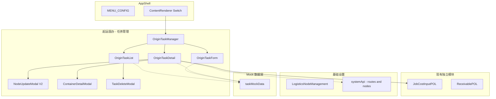
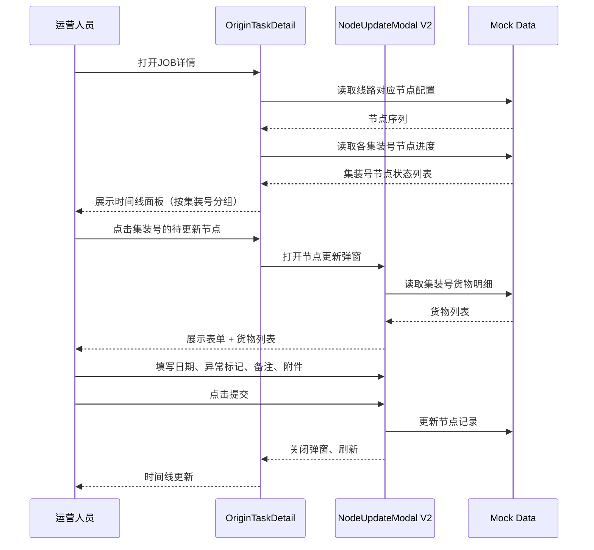
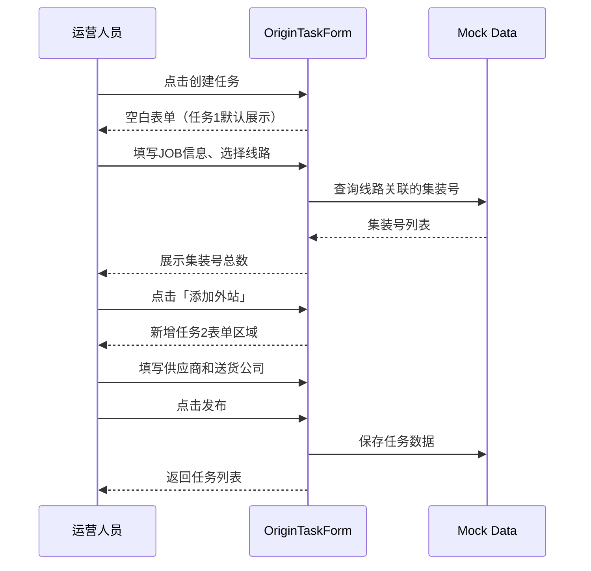
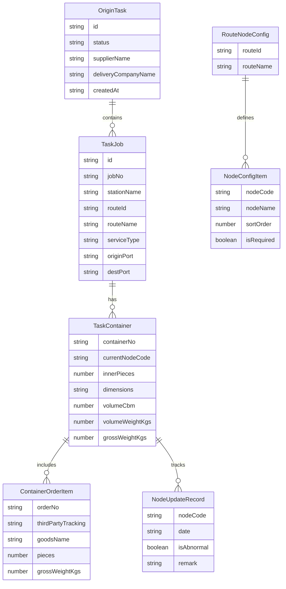

# 技术设计文档

## 概述

**目标**: 将起运国办的「创建任务」和「出口跟踪」整合为统一的任务管理模块，引入「任务（Task）」作为 JOB 的上层聚合概念，实现多JOB聚合视图、按集装号粒度的动态运输节点跟踪。

**用户**: 起运国运营人员，用于创建运输任务、管理JOB集装号、跟踪出口全流程。

**影响**: 替换现有 `JobManager`/`ExportTracking` 的菜单入口，新建独立组件集。现有 `JobCostInputPOL`/`ReceivablePOL` 等独立模块不受影响。

### 目标
- 多JOB聚合任务管理，一个任务可包含多个站点/JOB
- 动态运输节点跟踪，节点序列从基础设置按线路读取
- 按集装号粒度推进节点状态，统一采集日期+异常标记+备注+附件
- 汇总状态取最落后节点（木桶效应）

### 非目标
- 不改造成本管理和应收管理模块（独立 spec）
- 不实现真实后端 API / BLE 通信 / 文件上传存储
- 不改动基础设置中的物流节点配置页面
- 不涉及到达国办的功能

## 架构

### 现有架构分析

现有 TMS 模块组件结构：
- `JobManager` → `JobList` / `JobDetail` / `TaskDetail`：以单个 JOB 为维度
- `ExportTracking`：独立的出口跟踪页面，4个固定阶段
- `NodeUpdateModal`：8个硬编码节点，不支持异常标记和附件

**限制**: 现有组件不支持「任务聚合多JOB」和「按集装号的动态节点跟踪」，需新建组件集。

### 架构模式与边界



**架构决策**:
- 选定模式: 新建独立组件集（`OriginTaskManager` 系列），与现有 `JobManager` 并存不冲突
- 边界: 任务管理模块完全自治，通过 Mock 数据层获取数据，通过菜单跳转与成本管理模块联动
- 保留模式: 沿用项目的 state-driven 导航、内联样式、useState 状态管理
- 新增理由: 引入 Task 聚合层级（Task → JOB → Container → Order）是现有 JOB-only 模型的扩展

### 技术栈

| 层 | 选型/版本 | 在本特性中的角色 | 备注 |
|---|----------|----------------|------|
| 前端框架 | React 19 + TypeScript | 所有组件实现 | 沿用现有 |
| UI 组件库 | Ant Design v6 | Table/Form/Modal/Timeline/Steps/Upload | 沿用现有 |
| 日期处理 | dayjs | 节点日期选择与格式化 | 沿用现有 |
| 状态管理 | useState + useMemo | 组件内状态自治 | 沿用现有，无 Redux |
| 样式方案 | 内联样式 + theme.useToken() | 全部样式 | 沿用现有 |
| 数据层 | 组件内 Mock 常量 | 任务/JOB/集装号/订单/节点数据 | Demo 原型模式 |

## 系统流程

### 运输节点更新流程



### 任务创建流程



## 需求追溯

| 需求 | 摘要 | 组件 | 接口 | 流程 |
|------|------|------|------|------|
| 1.1-1.3 | 任务列表多JOB聚合 + 汇总状态 | OriginTaskList | OriginTask 类型 | - |
| 1.4-1.5 | 筛选与搜索 | OriginTaskList | 筛选状态 | - |
| 1.6-1.8 | 创建/编辑/删除操作 | OriginTaskList, TaskDeleteModal | 回调 Props | - |
| 1.9 | 集装号详情展示 | ContainerDetailModal | ContainerDetail 类型 | - |
| 2.1-2.3 | 任务创建多JOB + 集装号关联 | OriginTaskForm | TaskFormData 类型 | 任务创建流程 |
| 2.4-2.5 | 供应商/送货公司信息 | OriginTaskForm | SupplierInfo/DeliveryCompany 类型 | - |
| 2.6-2.8 | 发布/返回/编辑操作 | OriginTaskForm | 回调 Props | - |
| 3.1-3.3 | JOB基础信息 + 站点汇总 + 集装号列表 | OriginTaskDetail | JobDetailData 类型 | - |
| 3.4 | 集装号货物明细 | ContainerDetailModal | ContainerOrderItem 类型 | - |
| 3.5 | 运输节点跟踪面板 | OriginTaskDetail, NodeUpdateModal V2 | NodeConfig/NodeProgress 类型 | 节点更新流程 |
| 3.6 | 跳转成本管理 | OriginTaskDetail | onNavigateToCost 回调 | - |
| 4.1-4.3 | 动态节点配置 + 时间线 + 按集装号展示 | OriginTaskDetail | RouteNodeConfig 类型 | - |
| 4.4-4.6 | 节点更新弹窗 + 提交 | NodeUpdateModal V2 | NodeUpdatePayload 类型 | 节点更新流程 |
| 4.7 | 异常标识 | OriginTaskDetail, OriginTaskList | isAbnormal 标记 | - |
| 4.8 | 弹窗内货物明细 | NodeUpdateModal V2 | ContainerOrderItem 类型 | - |
| 4.9 | 汇总状态取最落后节点 | OriginTaskList | computeTaskSummaryStatus 工具函数 | - |
| 5.1-5.4 | 删除确认 + 部分删除 | TaskDeleteModal | 回调 Props | - |
| 6.1-6.6 | Mock 数据 | taskMockData 模块 | 所有类型定义 | - |

## 组件与接口

### 组件总览

| 组件 | 层 | 职责 | 需求覆盖 | 关键依赖 | 接口类型 |
|------|---|------|---------|---------|---------|
| OriginTaskManager | 路由控制 | 管理 LIST/FORM/DETAIL 视图切换 | 1.6, 1.7, 2.6, 2.7 | OriginTaskList, OriginTaskForm, OriginTaskDetail (P0) | State |
| OriginTaskList | UI 列表 | 多JOB聚合列表、筛选、搜索、汇总状态 | 1.1-1.9, 4.9 | taskMockData (P0), TaskDeleteModal (P1) | State |
| OriginTaskForm | UI 表单 | 任务创建/编辑，多JOB表单 | 2.1-2.8 | taskMockData (P0) | State |
| OriginTaskDetail | UI 详情 | JOB详情 + 站点汇总 + 集装号 + 节点跟踪 | 3.1-3.6, 4.1-4.3, 4.7, 4.9 | NodeUpdateModal V2 (P0), ContainerDetailModal (P1) | State |
| NodeUpdateModal V2 | UI 弹窗 | 动态节点更新表单 + 货物明细 | 4.4-4.6, 4.8 | taskMockData (P0) | State |
| ContainerDetailModal | UI 弹窗 | 集装号关联订单货物展示 | 1.9, 3.4 | taskMockData (P0) | State |
| TaskDeleteModal | UI 弹窗 | 删除确认 + 部分JOB选择 | 5.1-5.4 | - | State |
| taskMockData | 数据层 | Mock 数据定义与工厂函数 | 6.1-6.6 | - | - |

### 路由控制层

#### OriginTaskManager

| 字段 | 详情 |
|------|------|
| 职责 | 管理任务管理模块的视图切换（列表/创建编辑/详情） |
| 需求 | 1.6, 1.7, 2.6, 2.7 |

**职责与约束**
- 维护当前视图状态和选中任务/JOB ID
- 纯路由控制，不包含业务逻辑
- 沿用 `JobManager` 的 state-driven 视图切换模式

**接口**: State

##### 状态管理
```typescript
interface OriginTaskManagerState {
  view: 'LIST' | 'FORM' | 'DETAIL';
  currentTaskId: string | undefined;
  currentJobId: string | undefined;
  isEditMode: boolean;
}
```

**实现备注**
- 注册到 App.tsx 的 `ContentRenderer`，替换 `tms_job_new` case
- Props: 无（顶层组件）

### UI 列表层

#### OriginTaskList

| 字段 | 详情 |
|------|------|
| 职责 | 任务列表展示、多JOB聚合行、筛选搜索、汇总状态计算 |
| 需求 | 1.1-1.9, 4.9 |

**职责与约束**
- 从 Mock 数据加载任务列表
- 使用 Ant Design Table 的 `expandable` 或行合并实现多JOB聚合显示
- 汇总状态通过 `computeTaskSummaryStatus` 计算

**依赖**
- Inbound: OriginTaskManager — 视图控制回调 (P0)
- External: taskMockData — 数据源 (P0)
- Outbound: TaskDeleteModal — 删除确认 (P1)
- Outbound: ContainerDetailModal — 集装号详情 (P1)

**接口**: State

##### Props 接口
```typescript
interface OriginTaskListProps {
  onCreate: () => void;
  onEdit: (taskId: string) => void;
  onViewDetail: (taskId: string, jobId: string) => void;
}
```

##### 汇总状态计算
```typescript
/** 取所有集装号中最落后的节点作为任务整体状态 */
function computeTaskSummaryStatus(
  task: OriginTask,
  nodeConfigs: RouteNodeConfig[]
): TaskSummaryStatus;

interface TaskSummaryStatus {
  currentNodeName: string;
  completedCount: number;
  totalCount: number;
  hasAbnormal: boolean;
}
```

**实现备注**
- 筛选条件：国家(Select)、城市(Select)、年月日(DatePicker)、执行状态(Select)
- 搜索：单输入框，模糊匹配 JOB号/起运港/司机/电话/车牌
- 集装号列以 Tag 形式缩略展示，超过阈值显示 `...More`

### UI 表单层

#### OriginTaskForm

| 字段 | 详情 |
|------|------|
| 职责 | 任务创建与编辑表单，支持多JOB、供应商、送货公司 |
| 需求 | 2.1-2.8 |

**职责与约束**
- 使用 Ant Design Form 管理表单状态
- 多JOB区域通过动态数组（类似 Form.List）实现
- 「添加外站」按钮新增 JOB 表单区块
- 编辑模式加载已有数据填充表单

**依赖**
- Inbound: OriginTaskManager — 视图控制 + taskId/isEditMode (P0)
- External: taskMockData — 数据源 + 选项数据 (P0)

**接口**: State

##### Props 接口
```typescript
interface OriginTaskFormProps {
  taskId?: string;
  isEditMode: boolean;
  onBack: () => void;
  onSubmit: () => void;
}
```

##### 表单数据模型
```typescript
interface TaskFormData {
  jobs: TaskJobFormItem[];
  supplier: SupplierInfo;
  deliveryCompany: DeliveryCompanyInfo;
}

interface TaskJobFormItem {
  jobNo: string;
  accountName: string;
  createdAt: string;
  stationName: string;
  routeId: string;
  dispatchCenter: string;
  serviceType: 'EXPRESS' | 'STANDARD';
  originPort: string;
  transitPort: string;
  destPort: string;
  cargoFilter: 'GENERAL' | 'NON_GENERAL' | 'ALL';
  weightKg: number;
  executeDate: string;
  remark: string;
  containerNos: string[];
}

interface SupplierInfo {
  supplierName: string;
  phone: string;
  address: string;
}

interface DeliveryCompanyInfo {
  companyName: string;
  trackingNo: string;
  queryPhone: string;
  driverName: string;
  driverPhone: string;
  plateNo: string;
}
```

**实现备注**
- 选择线路后自动查询关联集装号，展示集装号总数和缩略列表
- 「返回」按钮：表单有修改时弹出 Modal.confirm 提示未保存
- 供应商选择后自动填充电话和地址

### UI 详情层

#### OriginTaskDetail

| 字段 | 详情 |
|------|------|
| 职责 | JOB完整详情展示：基础信息、站点汇总、集装号列表、运输节点跟踪面板 |
| 需求 | 3.1-3.6, 4.1-4.3, 4.7, 4.9 |

**职责与约束**
- 顶部 Descriptions 展示 JOB 基础信息
- 中部 Table 展示站点汇总和集装号列表
- 底部运输节点跟踪面板：按集装号分组，每组一个 Steps/Timeline
- 读取 Mock 的线路节点配置，动态生成步骤条

**依赖**
- Inbound: OriginTaskManager — taskId/jobId (P0)
- Outbound: NodeUpdateModal V2 — 节点更新 (P0)
- Outbound: ContainerDetailModal — 集装号详情 (P1)
- External: taskMockData — 数据 + 节点配置 (P0)

**接口**: State

##### Props 接口
```typescript
interface OriginTaskDetailProps {
  taskId: string;
  jobId: string;
  onBack: () => void;
  onNavigateToCost?: (jobId: string) => void;
}
```

##### 节点跟踪数据结构
```typescript
/** 线路节点配置（来自基础设置 Mock） */
interface RouteNodeConfig {
  routeId: string;
  nodes: NodeConfigItem[];
}

interface NodeConfigItem {
  nodeCode: string;
  nodeName: string;
  sortOrder: number;
  isRequired: boolean;
}

/** 集装号节点进度 */
interface ContainerNodeProgress {
  containerNo: string;
  completedNodes: NodeUpdateRecord[];
  currentNodeCode: string;
}

interface NodeUpdateRecord {
  nodeCode: string;
  date: string;
  isAbnormal: boolean;
  remark: string;
  attachments: AttachmentInfo[];
  operator: string;
  updatedAt: string;
}

interface AttachmentInfo {
  uid: string;
  name: string;
  size: number;
  type: string;
}
```

**实现备注**
- 运输节点面板使用 Card + Collapse，每个集装号一个 Panel
- Steps 组件 `status` 属性动态设置：finish/process/wait/error
- 异常节点 Steps.Step 使用 `status="error"` + 红色图标
- 「查看成本」按钮调用 `onNavigateToCost`，跳转逻辑由 App.tsx 层处理

### UI 弹窗层

#### NodeUpdateModal V2

| 字段 | 详情 |
|------|------|
| 职责 | 动态节点更新表单，展示货物明细，统一采集日期+异常+备注+附件 |
| 需求 | 4.4-4.6, 4.8 |

**职责与约束**
- Modal 弹窗，`destroyOnClose` 保证表单重置
- 表单字段：日期(DatePicker 必填)、是否异常(Radio 必填)、备注(TextArea 选填)、附件(Upload 选填)
- 底部 Table 展示当前集装号的货物明细
- 附件上传使用 Mock 模式（`beforeUpload` 返回 false）

**依赖**
- Inbound: OriginTaskDetail — 集装号/节点信息 (P0)
- External: taskMockData — 货物明细 (P0)

**接口**: State

##### Props 接口
```typescript
interface NodeUpdateModalProps {
  visible: boolean;
  containerNo: string;
  nodeConfig: NodeConfigItem;
  orderItems: ContainerOrderItem[];
  onSubmit: (payload: NodeUpdatePayload) => void;
  onCancel: () => void;
}

interface NodeUpdatePayload {
  containerNo: string;
  nodeCode: string;
  date: string;
  isAbnormal: boolean;
  remark: string;
  attachments: AttachmentInfo[];
}

interface ContainerOrderItem {
  seq: number;
  orderNo: string;
  thirdPartyTracking: string;
  city: string;
  salesPerson: string;
  userName: string;
  goodsName: string;
  description: string;
  pieces: number;
  volumeCbm: number;
  volumeWeightKgs: number;
  grossWeightKgs: number;
}
```

#### ContainerDetailModal

| 字段 | 详情 |
|------|------|
| 职责 | 集装号下关联订单货物的详情展示 |
| 需求 | 1.9, 3.4 |

**实现备注**: 简单 Modal + Table，复用 `ContainerOrderItem` 类型，底部合计行。Props 为 `visible/containerNo/items/onClose`。

#### TaskDeleteModal

| 字段 | 详情 |
|------|------|
| 职责 | 删除确认对话框，支持勾选部分JOB删除 |
| 需求 | 5.1-5.4 |

**实现备注**: Modal 内使用 Checkbox.Group 列出 JOB（含站点名称+线路），用户勾选后确认删除。全选时删除整个任务。

##### Props 接口
```typescript
interface TaskDeleteModalProps {
  visible: boolean;
  task: OriginTask;
  onConfirm: (selectedJobIds: string[]) => void;
  onCancel: () => void;
}
```

### 数据层

#### taskMockData

| 字段 | 详情 |
|------|------|
| 职责 | 提供任务管理模块所有 Mock 数据和工厂函数 |
| 需求 | 6.1-6.6 |

**职责与约束**
- 定义核心数据类型和 Mock 常量
- 提供至少 10 条任务、覆盖多线路和多状态
- 包含线路节点配置 Mock 数据
- 包含异常节点更新记录

## 数据模型

### 领域模型



### 逻辑数据模型

**核心实体类型定义**:

```typescript
/** 任务（聚合根） */
interface OriginTask {
  id: string;
  jobs: TaskJob[];
  supplier: SupplierInfo;
  deliveryCompany: DeliveryCompanyInfo;
  status: 'PENDING' | 'IN_PROGRESS' | 'COMPLETED';
  createdBy: string;
  createdAt: string;
  updatedAt: string;
}

/** 任务下的 JOB */
interface TaskJob {
  id: string;
  jobNo: string;
  stationName: string;
  routeId: string;
  routeName: string;
  serviceType: 'EXPRESS' | 'STANDARD';
  originPort: string;
  transitPort: string;
  destPort: string;
  cargoFilter: 'GENERAL' | 'NON_GENERAL' | 'ALL';
  weightKg: number;
  pieces: number;
  executeDate: string;
  remark: string;
  containers: TaskContainer[];
  /** 站点汇总信息 */
  stationSummary: StationSummary;
}

interface StationSummary {
  orderCount: number;
  pieces: number;
  weightKgs: number;
  weightRatio: number;
  receivableRatio: number;
  payableRatio: number;
  recoveryRatio: number;
}

/** JOB 基础信息（详情页顶部） */
interface JobBasicInfo {
  jobNo: string;
  serviceType: string;
  billOfLadingNo: string;
  carrier: string;
  pieces: number;
  blWeight: number;
  orderWeight: number;
  originPort: string;
  destPort: string;
  departureDate: string;
  sailingDate: string;
  arrivalDate: string;
}

/** 集装号 */
interface TaskContainer {
  containerNo: string;
  routeName: string;
  serviceType: string;
  description: string;
  innerPieces: number;
  dimensions: string;
  volumeCbm: number;
  volumeWeightKgs: number;
  grossWeightKgs: number;
  orders: ContainerOrderItem[];
  nodeProgress: ContainerNodeProgress;
}
```

**一致性规则**:
- 任务删除时，如果所有 JOB 均被移除，任务记录同步删除
- 汇总状态实时计算，不持久化（Demo 原型）

## 错误处理

### 错误策略
Demo 原型采用简化错误处理：
- **用户操作错误**: 表单验证 → Ant Design Form 内联校验
- **Mock 数据异常**: 空数据 → 显示 Empty 组件
- **未保存退出**: Modal.confirm 提示

### 错误分类
- **表单验证** (需求 2.6): 必填字段为空 → Form 红色提示
- **删除保护** (需求 5.1): 确认对话框 → 防误删
- **空状态** (需求 1.1): 无任务数据 → Table 的 `locale.emptyText`

## 测试策略

项目无测试框架，以手动验证为主：

### 验证清单
- 任务列表: 多JOB聚合显示正确、汇总状态计算正确、筛选搜索生效
- 任务创建: 多JOB添加/删除、供应商自动填充、表单验证
- JOB详情: 基础信息展示、集装号列表、站点汇总合计行
- 节点跟踪: 动态节点序列正确、按集装号独立更新、异常标识显示、附件 Mock
- 删除确认: 部分JOB删除、全部删除时任务同步删除
