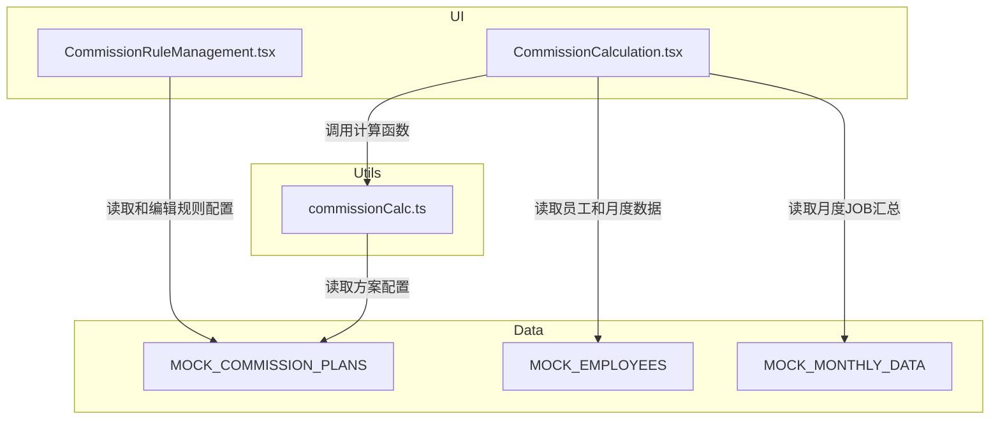
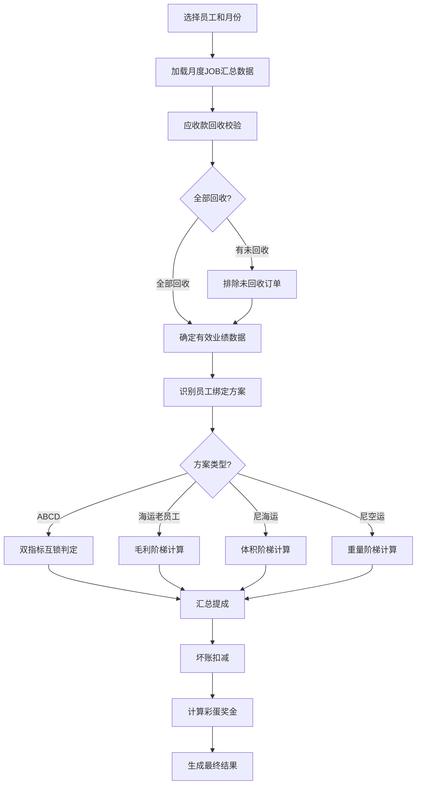
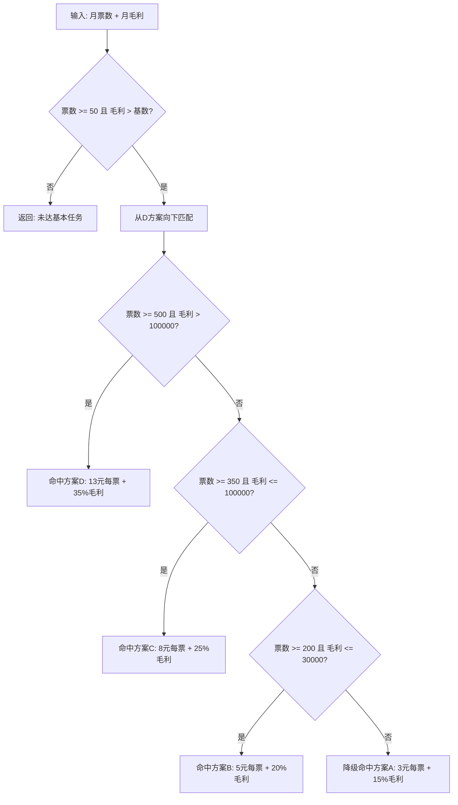
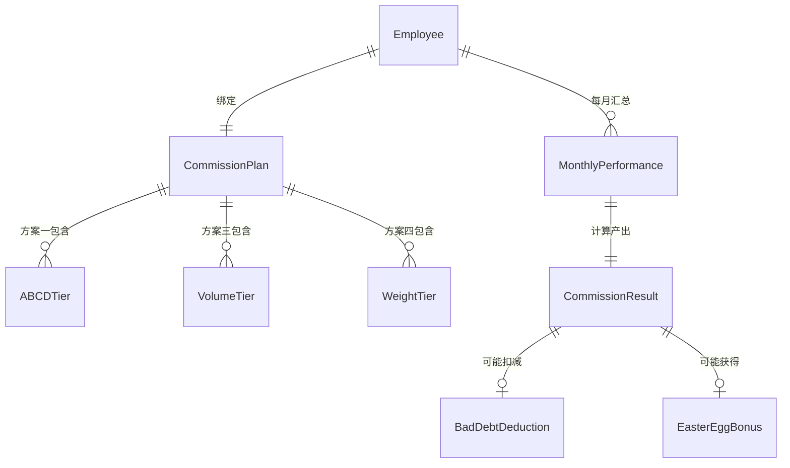

# Design Document

## Overview

**Purpose**: 本特性为喵喵国际物流管理系统的财务模块提供完整的销售提成奖金体系，支持4套差异化提成方案和团队彩蛋奖金的规则管理与月度计算。

**Users**: 财务人员（FINANCE）执行月度提成计算和发放；管理员（ADMIN）和老板（BOSS）配置提成规则参数。

**Impact**: 完全重构现有 `CommissionRuleManagement.tsx` 和 `CommissionCalculation.tsx`，新建 `commissionCalc.ts` 计算工具库。保留现有 App.tsx 菜单注册（tab key 不变），增加 FINANCE 角色对规则管理的可见性。

### Goals
- 实现4套提成方案（广州ABCD、海运老员工、尼日利亚海运、尼日利亚空运）的完整计算逻辑
- 实现彩蛋奖金（团队重量目标奖励）的触发判定和按比例分配
- 支持应收款校验、坏账扣减、连续月绩效追踪等通用规则
- 提供可视化规则管理界面和月度提成计算界面

### Non-Goals
- 真实后端 API 对接（使用 Mock 数据）
- 实际薪资系统集成
- 汇率换算（NGN/CNY 各自独立展示）
- 历史数据迁移

## Architecture

### Existing Architecture Analysis

现有两个组件均在 `/client/src/pages/finance/` 目录下：
- `CommissionRuleManagement.tsx`（1137行）：通用规则管理，使用 PERCENTAGE/TIERED/FIXED/HYBRID 四种规则类型，空数组初始化，无 Mock 数据
- `CommissionCalculation.tsx`（849行）：按单个 JOB 粒度的提成记录管理，含审批流程（PENDING → APPROVED → PAID）

**需重构的原因**：
- 现有规则模型无法表达双指标互锁、体积/重量阶梯、多币种等差异化方案
- 现有计算按逐单 JOB 执行，而需求要求月度汇总后按方案计算
- 彩蛋奖金为团队级计算，现有架构无团队维度

### Architecture Pattern & Boundary Map



**Architecture Integration**:
- Selected pattern: 策略模式工具库 — 每套方案对应独立计算函数，调度函数按方案类型路由
- Domain boundaries: 计算逻辑（commissionCalc.ts）与 UI 展示（两个页面组件）严格分离
- Existing patterns preserved: 内联样式 + useState/useMemo + Mock 数据 + Ant Design 组件
- Steering compliance: Module-first 组织、TypeScript strict、无外部状态管理

### Technology Stack

| Layer | Choice / Version | Role in Feature | Notes |
|-------|------------------|-----------------|-------|
| Frontend | React 19 + TypeScript | UI 组件和类型系统 | 严格模式 |
| UI Library | Ant Design v6 | 表单、表格、统计卡片等 | 内联样式 |
| Calculation | commissionCalc.ts | 纯函数计算工具库 | 复用 freightCalc.ts 模式 |
| Data | 内存 Mock | 规则配置和业务数据 | 组件文件内定义 |

## System Flows

### 月度提成计算流程



### 方案一双指标互锁匹配流程



## Requirements Traceability

| Requirement | Summary | Components | Interfaces | Flows |
|-------------|---------|------------|------------|-------|
| 1.1-1.6 | 广州ABCD双指标互锁 | commissionCalc, CommissionCalculation | calcPlanABCD | 双指标互锁匹配 |
| 2.1-2.6 | 海运老员工毛利百分比 | commissionCalc, CommissionCalculation | calcPlanSeaVeteran | 月度计算 |
| 3.1-3.5 | 尼日利亚海运体积阶梯 | commissionCalc, CommissionCalculation | calcPlanNigeriaSea | 月度计算 |
| 4.1-4.6 | 尼日利亚空运重量阶梯 | commissionCalc, CommissionCalculation | calcPlanNigeriaAir | 月度计算 |
| 5.1-5.5 | 彩蛋奖金团队分配 | commissionCalc, CommissionCalculation | calcEasterEggBonus | 月度计算 |
| 6.1-6.3 | 应收款回收校验 | commissionCalc | filterByReceivableStatus | 月度计算 |
| 7.1-7.6 | 月度汇总与绩效追踪 | commissionCalc, CommissionCalculation | aggregateMonthlyData, trackPerformance | 月度计算 |
| 8.1-8.4 | 坏账扣减与奖金发放 | commissionCalc, CommissionCalculation | applyBadDebtDeduction | 月度计算 |
| 9.1-9.6 | 提成规则管理界面 | CommissionRuleManagement | State | - |
| 10.1-10.6 | 提成计算操作界面 | CommissionCalculation | State | 月度计算 |

## Components and Interfaces

| Component | Domain | Intent | Req Coverage | Key Dependencies | Contracts |
|-----------|--------|--------|--------------|-----------------|-----------|
| commissionCalc.ts | Utils | 4套方案 + 彩蛋奖金 + 通用规则的纯计算函数 | 1-8 | 无外部依赖 (P0) | Service |
| CommissionRuleManagement.tsx | UI/Finance | 提成规则可视化管理 | 9 | commissionCalc 类型 (P0) | State |
| CommissionCalculation.tsx | UI/Finance | 月度提成计算和结果展示 | 10, 1-8 | commissionCalc (P0) | State |

### Utils

#### commissionCalc.ts

| Field | Detail |
|-------|--------|
| Intent | 提供4套差异化提成方案 + 彩蛋奖金 + 通用规则的全部计算逻辑 |
| Requirements | 1.1-1.6, 2.1-2.6, 3.1-3.5, 4.1-4.6, 5.1-5.5, 6.1-6.3, 7.1-7.6, 8.1-8.4 |

**Responsibilities & Constraints**
- 提供所有类型定义：方案枚举、配置接口、计算结果接口
- 提供默认配置常量（4套方案参数 + 彩蛋奖金参数）
- 所有计算函数为纯函数，接受配置参数，返回结构化结果
- 金额保留2位小数

**Dependencies**
- 无外部依赖，纯 TypeScript 模块

**Contracts**: Service [x]

##### Service Interface

```typescript
/** 方案类型枚举 */
type CommissionPlanType =
  | 'PLAN_A_ABCD'          // 广州主方案ABCD
  | 'PLAN_B_SEA_VETERAN'   // 海运老员工方案
  | 'PLAN_C_NIGERIA_SEA'   // 尼日利亚海运方案
  | 'PLAN_D_NIGERIA_AIR';  // 尼日利亚空运方案

/** 币种 */
type Currency = 'CNY' | 'NGN';

/** ABCD 阶梯定义 */
interface ABCDTier {
  level: 'A' | 'B' | 'C' | 'D';
  minTickets: number;             // 最低票数
  maxGrossProfit: number | null;  // 毛利上限(null=无上限)
  pricePerTicket: number;         // 每票单价(元)
  profitRate: number;             // 毛利提成比例
}

/** 方案一配置 */
interface PlanABCDConfig {
  baseTickets: number;            // 基本任务票数(50)
  salaryMultiplier: number;       // 毛利基数=工资×N(3)
  tiers: ABCDTier[];
}

/** 海运老员工方案配置 */
interface PlanSeaVeteranConfig {
  baseTask: number;               // 基本任务(6000元)
  tierBreakpoint: number;         // 分段点(35000元)
  lowerRate: number;              // 低段比例(0.4)
  upperRate: number;              // 高段比例(0.5)
}

/** 尼日利亚海运方案配置 */
interface PlanNigeriaSeaConfig {
  baseTaskCBM: number;            // 基本任务(30m³)
  tiers: Array<{
    minCBM: number;
    maxCBM: number | null;
    pricePerCBM: number;          // NGN/m³
  }>;
}

/** 尼日利亚空运方案配置 */
interface PlanNigeriaAirConfig {
  baseTaskKg: number;             // 基本任务(1000kg)
  tiers: Array<{
    level: 'A' | 'B' | 'C';
    maxKg: number;
    pricePerKg: number;           // NGN/kg
  }>;
}

/** 彩蛋奖金配置 */
interface EasterEggBonusConfig {
  triggerWeightKg: number;        // 触发重量(40000kg)
  bonusAmount: number;            // 奖金总额(15000元)
  minPersonalWeightKg: number;    // 个人最低贡献(2000kg)
  minQualifiedCount: number;      // 最低达标人数(2)
}

/** 月度业绩数据(汇总后) */
interface MonthlyPerformance {
  employeeId: string;
  month: string;                  // YYYY-MM
  totalTickets: number;           // 总票数
  totalGrossProfit: number;       // 总毛利(CNY)
  totalVolumeCBM: number;         // 总体积(m³)
  totalWeightKg: number;          // 总重量(kg)
  seaGrossProfit: number;         // 海运毛利
  airGrossProfit: number;         // 空运毛利
  excludedOrders: number;         // 被排除订单数(应收未回)
  receivableStatus: 'ALL_COLLECTED' | 'PARTIAL';
}

/** 方案一计算结果 */
interface PlanABCDResult {
  planType: 'PLAN_A_ABCD';
  qualified: boolean;
  matchedLevel: 'A' | 'B' | 'C' | 'D' | null;
  ticketCount: number;
  grossProfit: number;
  profitBase: number;             // 毛利基数
  ticketCommission: number;       // 票数提成
  profitCommission: number;       // 毛利提成
  totalCommission: number;
  currency: 'CNY';
  degraded: boolean;              // 是否降级匹配
}

/** 方案二计算结果 */
interface PlanSeaVeteranResult {
  planType: 'PLAN_B_SEA_VETERAN';
  qualified: boolean;
  seaGrossProfit: number;
  lowerBandAmount: number;        // 低段提成
  upperBandAmount: number;        // 高段提成
  seaCommission: number;
  airSupplementAmount: number;    // 空运补足金额
  totalCommission: number;
  currency: 'CNY';
}

/** 方案三计算结果 */
interface PlanNigeriaSeaResult {
  planType: 'PLAN_C_NIGERIA_SEA';
  qualified: boolean;
  totalVolumeCBM: number;
  tierBreakdown: Array<{ tier: string; volume: number; amount: number }>;
  totalCommission: number;
  currency: 'NGN';
}

/** 方案四计算结果 */
interface PlanNigeriaAirResult {
  planType: 'PLAN_D_NIGERIA_AIR';
  qualified: boolean;
  totalWeightKg: number;
  excessWeight: number;           // 超出基本任务重量
  matchedLevel: 'A' | 'B' | 'C' | null;
  totalCommission: number;
  currency: 'NGN';
}

/** 彩蛋奖金结果 */
interface EasterEggBonusResult {
  triggered: boolean;
  teamTotalWeight: number;
  qualifiedMembers: Array<{
    employeeId: string;
    weight: number;
    ratio: number;
    bonus: number;
  }>;
  invalidReason: string | null;   // 无效原因
}

/** 坏账扣减结果 */
interface BadDebtDeductionResult {
  originalAmount: number;
  badDebtAmount: number;
  deferredAmount: number;         // 递延扣减
  finalAmount: number;
}

/** 绩效追踪结果 */
interface PerformanceTrackResult {
  consecutiveQualified: number;
  consecutiveUnqualified: number;
  suggestion: 'RAISE' | 'CUT' | 'DISMISS' | null;
}

// ===== 计算函数签名 =====

function calcPlanABCD(
  performance: MonthlyPerformance,
  salary: number,
  config: PlanABCDConfig
): PlanABCDResult;

function calcPlanSeaVeteran(
  performance: MonthlyPerformance,
  airCommission: number,
  config: PlanSeaVeteranConfig
): PlanSeaVeteranResult;

function calcPlanNigeriaSea(
  performance: MonthlyPerformance,
  config: PlanNigeriaSeaConfig
): PlanNigeriaSeaResult;

function calcPlanNigeriaAir(
  performance: MonthlyPerformance,
  config: PlanNigeriaAirConfig
): PlanNigeriaAirResult;

function calcEasterEggBonus(
  teamPerformances: MonthlyPerformance[],
  config: EasterEggBonusConfig
): EasterEggBonusResult;

function applyBadDebtDeduction(
  commissionAmount: number,
  badDebtAmount: number,
  previousDeferred: number
): BadDebtDeductionResult;

function trackPerformance(
  monthlyResults: Array<{ month: string; qualified: boolean }>
): PerformanceTrackResult;
```

- Preconditions: 输入的 MonthlyPerformance 已完成应收款校验过滤
- Postconditions: 返回结构化结果对象，金额保留2位小数
- Invariants: 纯函数，无副作用

**Implementation Notes**
- 复用 freightCalc.ts 的 round2 模式进行小数处理
- 默认配置常量包含所有4套方案的阶梯参数和彩蛋奖金参数
- 方案一 ABCD 匹配顺序：从 D 向 A 降级匹配

### UI / Finance

#### CommissionRuleManagement.tsx

| Field | Detail |
|-------|--------|
| Intent | 4套提成方案 + 彩蛋奖金的规则参数可视化管理 |
| Requirements | 9.1-9.6 |

**Responsibilities & Constraints**
- 列表展示全部方案：名称、适用地区、业务类型、阶梯数量、状态
- 按方案类型分 Tab 的配置表单（Modal）
- 支持 Form.List 动态增删阶梯行
- 彩蛋奖金作为独立配置卡片
- 仅 ADMIN、FINANCE、BOSS 可见（App.tsx roles 需更新）

**Dependencies**
- Inbound: commissionCalc.ts 类型定义 (P0)
- External: Ant Design v6 Form/Table/Modal/Tabs (P0)

**Contracts**: State [x]

##### State Management

```typescript
interface RuleManagementState {
  plans: CommissionPlan[];          // 4套方案+彩蛋配置
  editModalVisible: boolean;
  currentPlan: CommissionPlan | null;
  bonusConfig: EasterEggBonusConfig;
}
```

**Implementation Notes**
- Mock 数据预填4套方案的默认配置
- 方案编辑表单使用 Tabs 组件：基本信息 Tab + 阶梯配置 Tab
- 方案一额外包含双指标参数（基本任务票数、工资倍数）
- 方案三/四标注币种为 NGN

#### CommissionCalculation.tsx

| Field | Detail |
|-------|--------|
| Intent | 月度提成计算执行、结果展示、绩效追踪和导出 |
| Requirements | 10.1-10.6, 1.1-8.4 |

**Responsibilities & Constraints**
- 员工选择（支持搜索）+ 月份选择 + 批量计算
- 自动识别员工绑定方案并显示
- 调用 commissionCalc.ts 函数执行计算
- 展示完整计算明细：业绩数据、应收款校验、方案匹配、费用分项、坏账扣减
- 汇总表格展示全员月度提成对比
- 绩效趋势展示（连续达标/未达标标记）
- 模拟导出功能

**Dependencies**
- Inbound: commissionCalc.ts 全部计算函数 (P0)
- External: Ant Design v6 Table/Descriptions/Statistic/Tag (P0), dayjs (P1)

**Contracts**: State [x]

##### State Management

```typescript
interface CalculationPageState {
  selectedEmployees: string[];
  selectedMonth: string;                    // YYYY-MM
  calculationResults: EmployeeCommissionResult[];
  detailDrawerVisible: boolean;
  currentDetail: EmployeeCommissionResult | null;
  performanceHistory: Map<string, PerformanceTrackResult>;
}

/** 员工提成汇总结果 */
interface EmployeeCommissionResult {
  employeeId: string;
  employeeName: string;
  planType: CommissionPlanType;
  month: string;
  performance: MonthlyPerformance;
  planResult: PlanABCDResult | PlanSeaVeteranResult | PlanNigeriaSeaResult | PlanNigeriaAirResult;
  easterEggBonus: number;
  badDebtDeduction: BadDebtDeductionResult;
  finalAmount: number;
  currency: Currency;
  payDate: string;
  performanceTrack: PerformanceTrackResult;
}
```

**Implementation Notes**
- useMemo 驱动实时计算，选择员工/月份后自动触发
- 详情 Drawer 沿用现有布局模式（左侧导航 + 右侧内容）
- 彩蛋奖金在团队汇总区域展示触发状态和个人分配
- 绩效追踪使用 Tag 颜色区分：绿色（连续达标）、红色（连续未达标）、金色（建议加薪）

## Data Models

### Domain Model



**Key Entities**:
- `CommissionPlan`: 提成方案配置（聚合根），包含方案类型、适用条件、阶梯参数
- `Employee`: 员工（含方案绑定、地区、工龄等属性），Mock 数据
- `MonthlyPerformance`: 月度业绩汇总值对象
- `CommissionResult`: 计算结果值对象（按方案类型有不同结构）

**Business Invariants**:
- 一个员工在同一时期只绑定一套提成方案
- 月度业绩数据仅包含已回收应收款的订单
- 彩蛋奖金仅在符合最低人数条件时发放
- 坏账扣减不足部分递延至后续月份

### Logical Data Model

**Employee Mock Structure**:

```typescript
interface MockEmployee {
  id: string;
  name: string;
  office: 'GUANGZHOU' | 'NIGERIA';
  planType: CommissionPlanType;
  monthlySalary: number;          // 方案一需要
  yearsOfService: number;         // 方案二需要
  annualGrossProfit: number;      // 方案二资格判定
  status: 'ACTIVE' | 'INACTIVE';
}
```

**Monthly JOB Summary Mock Structure**:

```typescript
interface MockMonthlyJobSummary {
  employeeId: string;
  month: string;
  jobs: Array<{
    jobNo: string;
    type: 'AIR' | 'SEA';
    tickets: number;
    grossProfit: number;
    volumeCBM: number;
    weightKg: number;
    receivableCollected: boolean;
    badDebtAmount: number;
  }>;
}
```

## Error Handling

### Error Strategy

- 输入验证：月份格式校验、员工选择非空校验
- 业务规则：未达基本任务返回 qualified=false 和提示信息
- 应收款未回收：排除并标记，不中断计算
- 彩蛋奖金无效：返回 invalidReason 说明原因

### Error Categories and Responses

**Business Logic Errors**:
- 未达基本任务 → 显示"未达基本任务"标签，提成为0
- 应收款未回收 → Alert 警告显示排除的订单数
- 彩蛋奖金无效 → 灰色标签"彩蛋奖金未触发"并说明原因
- 坏账递延 → 橙色 Tag 标记递延余额

## Testing Strategy

项目为 Demo 原型，无测试框架。验证方式：
- 浏览器手动验证：方案一（15kg普货 50票 20000毛利 → 命中方案A）
- 验证降级匹配：500票但毛利25000 → 应降级到B
- 验证方案三：100m³ → 30-100段 70m³ × 5000 = NGN 350,000
- 验证彩蛋奖金：团队45吨，3人各达2000kg → 按比例分配15000元
