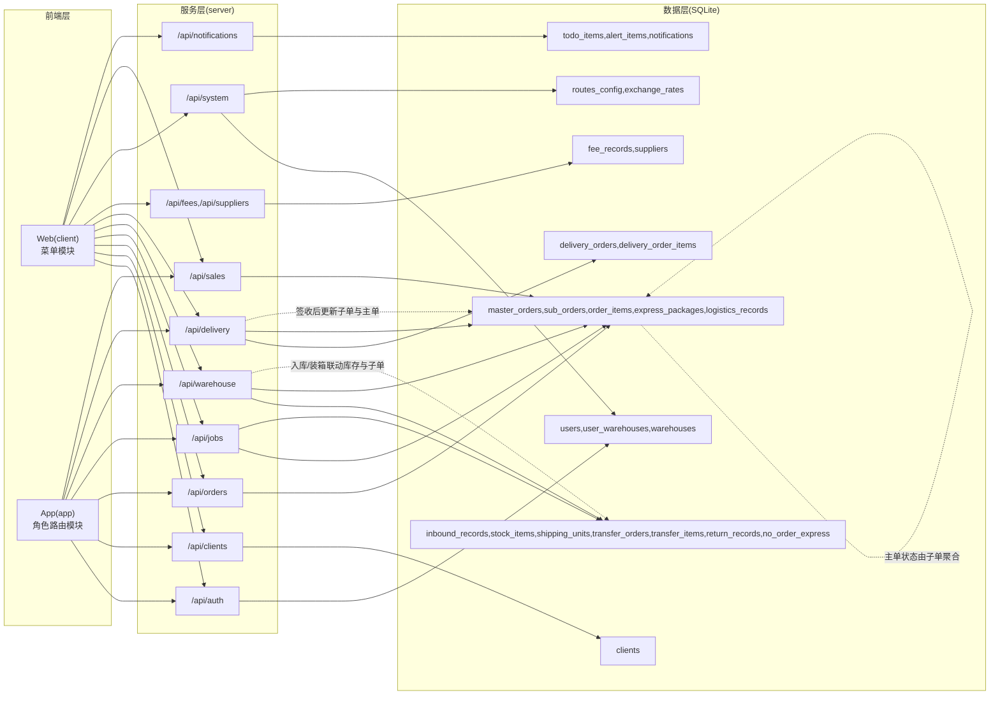
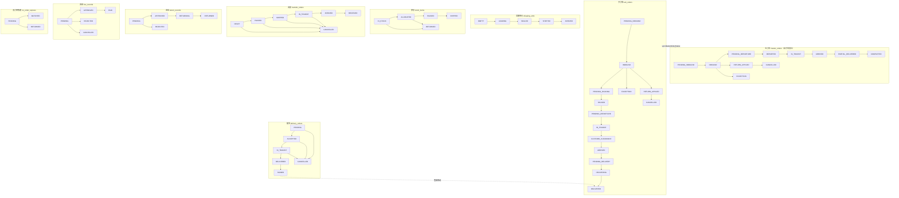

# 全系统数据与状态流转图（Web + App）

## 1. 范围说明
- Web 管理后台：`client`
- App（仓库/销售移动端）：`app`
- 后端 API 与数据层：`server` + `server/logistics.db`

核心依据文件：
- `client/src/App.tsx`
- `app/src/App.tsx`
- `server/src/routes/*.ts`
- `server/src/database/schema.ts`

---

## 2. 功能总览

### 2.1 Web（client）
- 工作台：工作概览、待办事项、预警中心
- 客户中心：公海池、我的客户
- 订单中心：主单/子单管理、退单审核、订单详情
- 起运国仓储：入库记录、库存、退运、无订单快递、海运/空运运输单元、调拨
- 起运国办（TMS）：任务管理、任务详情、任务与运输单元绑定
- 到达国办（TMS）：到达国任务管理
- 到达国仓储：到港入库、配送、库存、调拨
- 财务中心：费用录入、费用审批、应收应付、提成、工资、报表、现金流
- 经营分析：经营看板、客户价值、线路盈利、物流时效、成本结构
- 系统设置：区域、供应商、快递、承运人、货类、线路、仓库、费率、汇率、物流环节、用户角色权限、流程配置

### 2.2 App（app）
- 通用：登录、仓库选择、个人中心
- 起运国仓：扫码入库、入库单详情、待入库、装箱扫描、装箱任务、库存、调拨、退运、无订单快递、快递匹配、扫码查件
- 到达国仓：到港入库扫描/记录、集装箱任务入库、配送建单/列表/详情、库存、调拨、扫码查件
- 销售端：销售看板、任务工作台、客户详情、订单创建/详情、报价、催款记录

---

## 3. 领域对象与主数据表
- 身份与组织：`users`、`warehouses`、`user_warehouses`
- 客户：`clients`
- 订单：`master_orders`、`sub_orders`、`order_items`、`express_packages`、`logistics_records`
- 仓储：`inbound_records`、`stock_items`、`shipping_units`
- 调拨与退运：`transfer_orders`、`transfer_items`、`return_records`、`no_order_express`
- 配送：`delivery_orders`、`delivery_order_items`
- 财务：`fee_records`、`suppliers`
- 系统配置：`routes_config`、`exchange_rates`
- 运营辅助：`todo_items`、`alert_items`、`notifications`

---

## 4. 数据流转图

---

## 5. 状态流转图

---

## 6. 关键联动规则（实现口径）
- 子订单状态变化后，服务端会写入 `logistics_records`，并同步聚合主订单状态。
- 仓储入库会同时写 `inbound_records`、更新 `sub_orders`，并更新/创建 `stock_items`。
- 装载运输单元会把子订单置为 `PACKED`，并更新 `shipping_units` 的装载统计与状态。
- 配送签收会将配送单推进到 `SIGNED`，并把关联子订单置为 `DELIVERED`，随后聚合主订单状态。
- 退单审批通过时，主单/子单进入取消链路，并触发库存、费用、配送等关联对象清理或状态变更。

---

## 7. 已对齐项（2026-03-05）
- `delivery_orders.status` 已纳入 `CANCELLED`，与 Web/App 取消配送动作一致。
